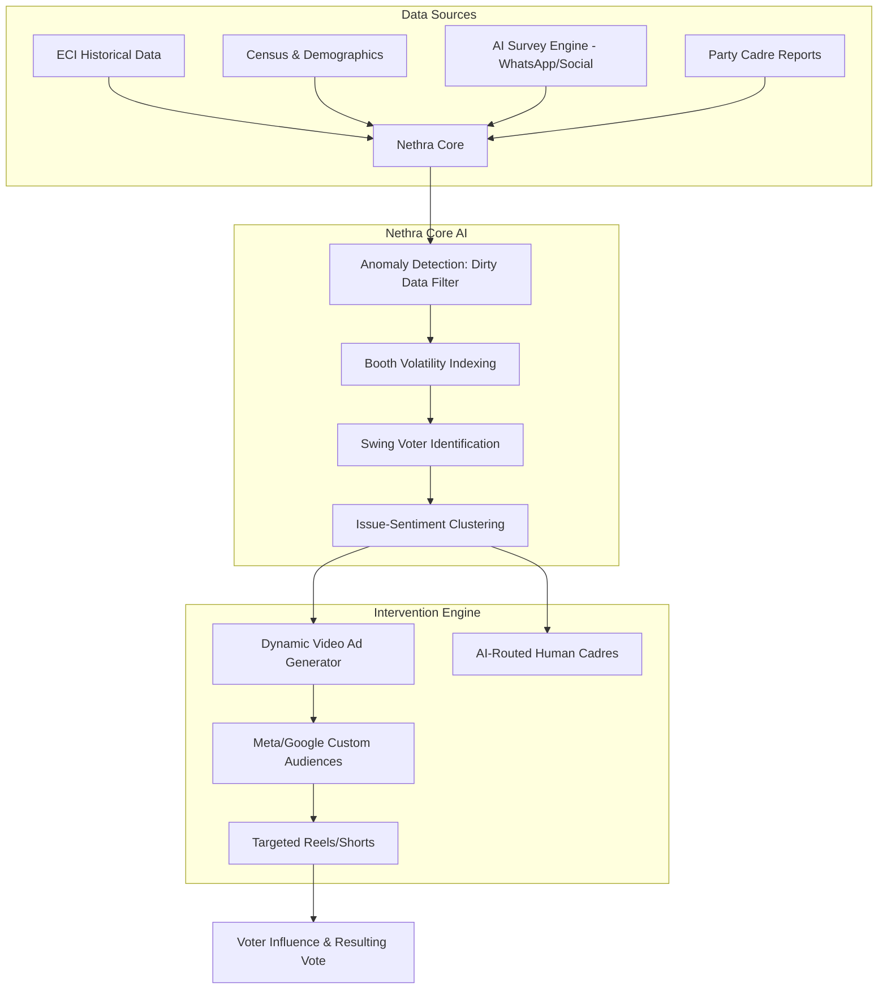

# Nethra: The Political AI Engine

> "You are wasting 80% of your campaign budget. We find the 20% who actually decide the election."

## Overview

Nethra is a next-generation political intelligence platform designed for the era of the **"Algorithm Election."** Inspired by the tectonic shifts in the May 2026 Tamil Nadu Assembly elections, Nethra moves beyond traditional rallies and blanket social media spending. 

Our core mission is to surgically identify the **Swing Voter** population—the only demographic that can be measurably influenced—and deploy hyper-personalized, AI-driven interventions to swing their behavior.

## The Problem
1.  **Wasted Spend:** Political parties spend billions "preaching to the choir" (supporters) or fighting lost causes (opponents).
2.  **Dirty Data:** Local cadre reports are often fabricated or biased, leading to flawed strategies.
3.  **Social Desirability Bias:** Traditional polling fails because voters often lie about their true intentions to strangers.

## The Nethra Solution
Nethra leverages three pillars of dominance:
*   **Efficiency:** Near-zero ad wastage by targeting only verified swing voters via phone-number matching.
*   **Algorithm Dominance:** Programmatic video content (Reels/Shorts) designed for high-velocity virality.
*   **Verifiable Metrics:** Causal ROI measurement using Treatment vs. Control booths.

## High-Level Architecture

## Project Structure
*   `README.md`: Project overview and strategy.
*   `docs/`: Detailed architectural and mathematical documentation.
    *   `technical_specs.html`: System architecture and tech stack.
    *   `mathematical_model.html`: The Volatility Index and Causal Inference logic.
    *   `survey_design_engine.html`: AI-driven polling and sentiment gathering.
    *   `data_engineering.html`: ETL pipelines and data simulation schemas.
    *   `visualization_specs.html`: Command Center UI/UX specifications.
*   `data/`: (Planned) Mirrored public datasets and simulated private data.

## Phase 1 Status: Documentation Only
Current progress is focused on the **Documentation & Architecture** phase. No implementation code is to be written until the theoretical foundations are brutally reviewed and aligned.
