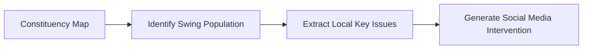

# Nethra: The Political AI Engine

> "Locate the Swing Voter. Identify their Issues. Generate the Influence Campaign."

## Overview

Nethra is a next-generation political intelligence platform designed for the era of the **"Algorithm Election."** Inspired by the tectonic shifts in the May 2026 Tamil Nadu Assembly elections, Nethra moves beyond traditional rallies to focus on the only population that decides the outcome: **The Swing Voter.**

## The Essence of the Prototype (Phase 1)
Our first prototype is a high-impact, visual demonstration built for Business Development (BD). It answers three critical questions for any political party:
1.  **Where are they?** A geospatial map pinpointing high-density swing voter constituencies and booths.
2.  **What do they care about?** Real-time identification of the specific local issues (e.g., Youth Unemployment, Water Supply) driving the volatility in those areas.
3.  **How do we influence them?** One-click generation of AI-crafted social media campaigns (Instagram Reels, YouTube Shorts) tailored to those specific voters and issues.

## Product Strategy: The PM Perspective
To accelerate time-to-market and ensure zero-friction development via **Gemini-CLI**, Nethra adopts a **Dual-Track Architecture**:

*   **Track 1: The Pitch Prototype (Weeks 1-4):** Optimized for visual impact using **Streamlit**, **Static Mock Data**, and **Google Gemini API**. It requires zero manual infrastructure setup and zero paid licenses.
*   **Track 2: The Production Vision:** A scalable, cloud-native architecture (Kafka, ClickHouse, Social Media Listening) designed to ingest real-world signals at scale.

## Core Demo Flow

## Project Structure
*   `README.md`: Project overview and strategy.
*   `GEMINI.md`: Project mandates and Gemini-CLI workflows.
*   `docs/`: Detailed architectural documentation.
    *   `technical_specs.md`: Architecture & Tech Stack (Dual-Track).
    *   `mathematical_model.md`: Swing Density & Issue Logic.
    *   `data_engineering.md`: Data strategy and Mock Generation.
    *   `visualization_specs.md`: Command Center UI & Demo Script.
*   `data/`: (Planned) Static mock datasets for the prototype.
