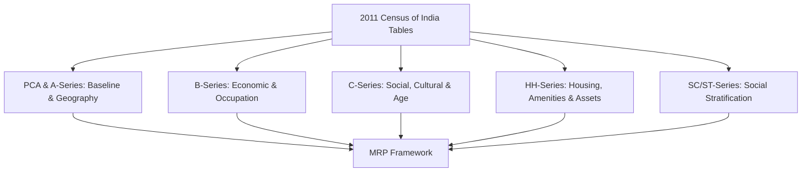

# Project Nethra: 2011 Census of India Data Integration & Feature Analysis

This report analyzes the official 2011 Census of India tables published by the Office of the Registrar General & Census Commissioner (ORGI) to determine their structural relevance for the **Bayesian Multilevel Regression and Poststratification (MRP)** engine of Project Nethra. It systematically groups these tables, distinguishes between demographic strata inputs and regional covariates, and establishes the strategic integration roadmap.

---

## 1. The 5-Perspective Strategic Analysis

As mandated by Project Nethra's Strategic Operating Manual, all data engineering and architectural decisions must be vetted through five critical operational lenses.

### 1. Political Leadership & IT Cell Perspective
*   **Analytical Intelligence:** By integrating granular census datasets (down to the village and ward levels), the IT Cell transitions from crude, gut-feel campaigning to high-resolution swing count forecasts.
*   **ROI & Resource Efficiency:** Hyper-targeted cohort targeting based on high-volatility demographic cells (e.g., educated unemployed youth in specific pin codes) ensures campaign spending is concentrated only on "moveable middle" cohorts, eliminating waste.
*   **Anomaly Detection:** Census baselines enable the IT Cell to flag booths where predicted swing probabilities ($V_{booth}$) diverge drastically from ground reports from cadre network surveys, facilitating instant operational correction.

### 2. ML & Data Engineering Perspective
*   **Demographic Strata Cells ($k$):** High-precision MRP requires a multi-dimensional Cartesian cell structure. Combining Census age, gender, social category (SC/ST/General), education, and occupation tables creates a high-fidelity Poststratification Frame of $K$ distinct demographic cells.
*   **Poststratification Raking:** Since the Census does not publish a 5-way joint distribution at the booth level, data engineering will execute **Iterative Proportional Fitting (IPF) / Raking** on marginal tables (e.g., C-09 for Education × Religion, B-4 for Occupation × Age) to reconstruct a synthetically complete booth-level poststratification frame (`poststratification_frame.csv`).
*   **Regional Covariates ($W_{booth}$):** Aggregate village amenities and household asset profiles are extracted as numeric vectors to feed the booth-level random effects model:
    $$
    \gamma_{booth} \sim \mathcal{N}(W_{booth} \theta, \sigma^2_{booth})
    $$

### 3. Behavioral Psychology Perspective
*   **Quantifiable Traits & Priors:** The Bayesian model utilizes census distress indicators as mathematical priors. For example, high concentrations of educated non-workers seeking employment (from Table B-8) or dilapidated housing conditions (from Table HH-1) serve as priors that shift the baseline swing volatility parameter ($\beta_0$) upwards.
*   **Cultural & Linguistic Affinity Priors:** Linguistic data (from C-16/C-18) is quantified as behavioral multipliers ($\gamma$). Cohorts showing high bilingualism or specific mother tongue profiles are mapped to tailored, culturally resonant messaging sets.

### 4. Ethics & Data Privacy Perspective
*   **Privacy by Design:** Project Nethra achieves surgical targeting precision without accessing or storing individual Voter ID names, phone numbers, or Personal Identifiable Information (PII).
*   **Data Minimization:** The regression model operates strictly on demographic counts ($N_{booth, k}$) and regional infrastructure covariates derived from publicly accessible voter rolls and census tables.
*   **HITL Safeguards:** All target parameters and regional segments generated via the census-linked model must undergo manual Human-in-the-Loop approval before micro-campaign assets are deployed on Meta/Google ad managers.

### 5. Product Management (PM) Perspective
*   **Scope Control (Dual-Track Execution):** Under Track 1 (The ML Prototype), the system will ingest a simplified synthetic CSV containing census-grounded strata weights, bypassing complex database setups. Track 2 (Production Vision) will scale this ingestion through a scalable pipeline (ClickHouse/AWS).
*   **Data Science Rigor:** Validation checks will automatically cross-verify raked synthetic counts against official district-level and sub-district-level PCA aggregates to enforce a maximum allowable cell deviation of $<1.5\%$.
*   **Implementation Readiness:** This analysis locks the schema for `/data/poststratification_frame.csv`, enabling developers to immediately scaffold the Streamlit UI and decouple scoring logic from presentation layers.

---

## 2. Census Series Classification & Grouping

The 382+ tables of the 2011 Census of India are grouped into six standard series, each mapping to a distinct component of Nethra's MRP architecture.

### A. A-Series & District Census Handbooks (General Population & Directories)
Provides the baseline geographical boundaries and infrastructure status.
*   **A-01 (Number of Villages, Towns, Households, Population, and Area):** Establish the baseline household and population size for each administrative block.
*   **DCHB Part A - Village Directory:** Houses village-specific amenities (schools, health centers, drinking water sources, power supply, mobile connectivity, banking institutions, and road type).
*   **DCHB Part A - Town Directory:** Details municipal infrastructure, sewage systems, and urban slum status.

### B. B-Series (General Economic Tables)
Defines the occupational and employment strata of the population.
*   **B-01 (Main, Marginal and Non-Workers classified by Age and Sex):** Sets the baseline work participation rates across age cohorts.
*   **B-02 (Workers/Non-Workers by Age, Sex, and Religious Community):** Highly valuable joint distribution mapping economic activity to religious strata.
*   **B-03 (Workers/Non-Workers classified by Educational Level and Sex):** Crosses education with employment status.
*   **B-04 (Main Workers by Industrial Category, Age, and Sex):** Classifies the workforce into Cultivators, Agricultural Labourers, Household Industry, and Other Workers across age groups.
*   **B-08 (Non-Workers and Marginal Workers seeking/available for work by Age, Sex, and Educational Level):** The primary data source for identifying localized economic distress and youth unemployment.

### C. C-Series (Social and Cultural Tables)
Details the socio-cultural, age, and educational characteristics of the population.
*   **C-01 (Population by Religious Community):** Baseline religious distribution at the district and sub-district level.
*   **C-02 (Marital Status by Age and Sex):** Demographic baseline for household stability and family structure.
*   **C-03 & C-03 Appendix (Marital Status by Religious Community, Age, and Sex):** Cross-classified religious family cohorts.
*   **C-08 (Educational Level by Age and Sex for Population 7+):** Defines the educational strata baseline.
*   **C-09 (Educational Level by Religious Community and Sex for Population 7+):** Crucial joint-marginal table for cross-referencing education and religion in the MRP strata raking.
*   **C-13 (Single-Year Age Returns by Residence and Sex):** High-resolution age distribution used to smooth age-cohort anomalies.
*   **C-14 (Population in Five-Year Age Groups by Residence and Sex):** Standard demographic age grouping.
*   **C-16 (Population by Mother Tongue):** Details mother-tongue counts to structure regional linguistic targeting.
*   **C-18 (Population by Bilingualism, Trilingualism, Age, and Sex):** Tracks linguistic flexibility across age cohorts.
*   **C-19 (Population by Bilingualism, Trilingualism, Education Level, and Sex):** Links linguistic capability directly to educational strata.

### H & HH-Series (Houselisting, Household Amenities, and Assets)
Details the physical infrastructure, living standards, and wealth indicators of households.
*   **HH-01 (Households by Condition of Census Houses):** Categories include *Good*, *Livable*, or *Dilapidated*, forming the physical baseline for socio-economic classification.
*   **HH-02 (Households by Predominant Material of Roof, Wall, and Floor):** Construction material parameters (e.g., thatch vs. concrete) used to calculate housing deprivation indices.
*   **HH-04 (Households by Ownership Status, Household Size, and Dwelling Rooms):** Tracks crowding density and rental status.
*   **HH-06 (Households by Availability of Electricity and Tenure Status):** Primary energy access metric.
*   **HH-07 (Households by Main Source of Drinking Water):** Tracks tap water vs. well/handpump access.
*   **HH-09 (Households by Availability of Latrine Facility):** Key sanitation infrastructure metric.
*   **HH-10 (Households by Separate Kitchen and Fuel Used for Cooking):** Identifies LPG vs. firewood/coal users (a major health/deprivation proxy).
*   **HH-11 (Households by Source/Location of Drinking Water, Electricity, and Latrine):** Composite basic amenities table.
*   **HH-12 (Households Availing Banking Services and Having Specified Assets):** Tracks ownership of: *Radio/Transistor, Television, Computer/Laptop (with/without Internet), Telephone/Mobile Phone, Bicycle, Scooter/Motorcycle/Moped, Car/Jeep/Van*. Crucial for forming the **Socio-Economic Wealth Index**.

### SC/ST-Series (Special Tables for Scheduled Castes & Scheduled Tribes)
Ensures deep representation and accurate strata modeling for historically marginalized social groups.
*   **SC-01 / ST-01 (Main Workers by Industrial Category, Age, and Sex for SC/ST):** Occupational profile of Scheduled Castes and Scheduled Tribes.
*   **SC-02 / ST-02 (Main Workers by Industrial Category, Educational Level, and Sex for SC/ST):** Crosses SC/ST workforce status with educational attainment.
*   **SC-05 / ST-05 (Marginal/Non-Workers Seeking Work by Educational Level, Age, and Sex for SC/ST):** Detailed youth unemployment and socio-economic distress markers within SC/ST communities.
*   **PCA (SC) / PCA (ST):** Primary Census Abstracts focused purely on Scheduled Caste and Scheduled Tribe populations down to the village and ward levels.

### PCA (Primary Census Abstract)
*   Provides the foundational totals for Households, Total Population, Child Population (0-6), SC/ST Population, Literates, Main/Marginal/Non-Workers, Cultivators, Agricultural Labourers, Household Industry Workers, and Other Workers at all levels. Essential for baseline validation and scaling.

---

## 3. Analytical Mapping: Demographic Strata vs. Regional Covariates

For the Bayesian MRP engine, the tables are divided into two distinct functional categories: **Demographic Strata Parameters** (used to define the $k$-cells for individual-level regression coefficients) and **Regional Covariates** (used to predict booth-level random effects).

| Structural Parameter | Feature Dimensions | Target Census Tables | Analytical Function in MRP |
| :--- | :--- | :--- | :--- |
| **Demographic Strata** ($\alpha_{k}$) | **Age** | C-14, C-13, C-02 | Categorizes voters into five core cohorts (18-25, 26-35, 36-50, 51-65, 66+). |
| | **Gender** | PCA, C-14, B-01 | Binary gender classifications crossed with age and work participation. |
| | **Social Category** | PCA, C-01, SC-01, ST-01 | Categorizes by Caste (General/OBC, SC, ST) and Religion (Hindu, Muslim, Christian, etc.). |
| | **Education** | C-08, C-09, B-03 | Divides into four tiers: Illiterate, Primary/Middle, Matric/Secondary, Graduate & Above. |
| | **Occupation** | B-04, SC-01, ST-01 | Divides into Cultivator, Agricultural Laborer, Household Industry, Other, and Non-Worker. |
| **Regional Covariates** ($W_{booth}$) | **Wealth & Asset Index** | HH-12 | Calculates a composite wealth score based on ownership of television, computer, internet, vehicles, and banking. |
| | **Housing Conditions** | HH-01, HH-02, HH-04 | Measures structural deprivation via house condition (dilapidated) and crowding density. |
| | **Sanitation & Power** | HH-06, HH-07, HH-09, HH-11 | Quantifies infrastructural deprivation based on lack of electricity, tap water, and latrines. |
| | **Village Infrastructure** | DCHB Village Directory | Incorporates distance to commercial banks, road connectivity, power availability, and mobile coverage. |
| | **Historical Volatility** | ECI Form 20 (Final Results) | Tracks booth-level historical swing variance ($HV_{booth}$) and margin of victory ($HM_{booth}$) over past elections. |

---

## 4. Bayesian Mathematical Integration Roadmap

The selected census tables feed directly into the two-step Bayesian MRP equation:

### Phase 1: The Hierarchical Regression Model
The individual-level swing probability $P(\text{Swing}_i)$ is modeled using demographic strata and booth random effects:
$$
P(\text{Swing}_i) = \text{logit}^{-1}\left( \beta_0 + \alpha_{age,i} + \alpha_{gender,i} + \alpha_{social,i} + \alpha_{occup,i} + \gamma_{booth,i} \right)
$$

Where the demographic strata parameters are modeled hierarchically:
*   $\alpha_{age} \sim \mathcal{N}(0, \sigma^2_{age})$
*   $\alpha_{gender} \sim \mathcal{N}(0, \sigma^2_{gender})$
*   $\alpha_{social} \sim \mathcal{N}(0, \sigma^2_{social})$
*   $\alpha_{occup} \sim \mathcal{N}(0, \sigma^2_{occup})$

And the booth-level random effect incorporates the regional covariates vector ($W_{booth}$) and **ECI Form 20 past election statistics** ($HV_{booth}$ and $HM_{booth}$):
$$
\gamma_{booth} \sim \mathcal{N}(\theta_1 \cdot HV_{booth} + \theta_2 \cdot HM_{booth} + W_{booth, census} \theta, \sigma^2_{booth})
$$
Where $\theta$ represents the coefficients indicating how strongly regional deprivation, asset indicators, and historical volatility influence voting volatility.

### Phase 2: Poststratification
Using the raked demographic counts $N_{booth, k}$ from the **PCA, C-09, and B-04 tables**, the aggregate booth-level volatility ($V_{booth}$) is projected:
$$
V_{booth} = \sum_{k=1}^{K} \left( N_{booth, k} \cdot \hat{P}_k \right)
$$
Where $\hat{P}_k$ is the estimated probability of swing for stratum $k$ derived from the fitted regression model.

---

## 5. PM Ingestion & Implementation Schema

To ensure Track 1 modularity and implementation readiness, the following CSV schemas must be utilized when converting the raw Excel/XML Census tables:

### Schema 1: Demographic Strata Weights (`poststratification_frame.csv`)
This file is generated at the Booth/Village/Ward level by raking marginal distributions from **PCA, C-09, and B-04**.
*   `booth_id` (PK / INT): Administrative booth identifier.
*   `age_group` (VARCHAR): `18-25`, `26-35`, `36-50`, `51-65`, `66+`.
*   `gender` (VARCHAR): `Male`, `Female`.
*   `social_group` (VARCHAR): `GEN_OBC`, `SC`, `ST`.
*   `religion` (VARCHAR): `HINDU`, `ISLAM`, `CHRISTIAN`, `OTHERS`.
*   `education` (VARCHAR): `ILLITERATE`, `PRIMARY_MIDDLE`, `MATRIC_SECONDARY`, `GRADUATE_ABOVE`.
*   `occupation` (VARCHAR): `AGRI_LAND`, `CULTIVATOR`, `HH_INDUSTRY`, `OTHER_WORKER`, `NON_WORKER`.
*   `n_voters` (INT): Total estimated eligible voters matching this exact stratum in the booth.

### Schema 2: Booth-Level Regional Covariates (`booth_covariates.csv`)
Derived from **HH-Series, DCHB Village Directories, and ECI Form 20 final results**.
*   `booth_id` (PK / INT): Administrative booth identifier.
*   `wealth_index` (FLOAT): Standardized score derived from asset ownership (HH-12).
*   `dilapidated_house_ratio` (FLOAT): Percentage of households in dilapidated structures (HH-01).
*   `electricity_access_ratio` (FLOAT): Percentage of households with power supply (HH-06).
*   `sanitation_deprivation_ratio` (FLOAT): Percentage of households lacking latrine facilities (HH-09).
*   `bank_distance_km` (FLOAT): Travel distance to nearest commercial/co-operative bank (Village Directory).
*   `mobile_coverage_status` (INT): `1` if village has mobile coverage, `0` otherwise (Village Directory).
*   `power_hours_domestic` (INT): Average daily hours of domestic power supply (Village Directory).
*   `historical_volatility_index` (FLOAT): Standard deviation of major party vote share over the last 3 elections (ECI Form 20).
*   `historical_margin_of_victory` (FLOAT): Average victory margin percentage in the booth (ECI Form 20).
