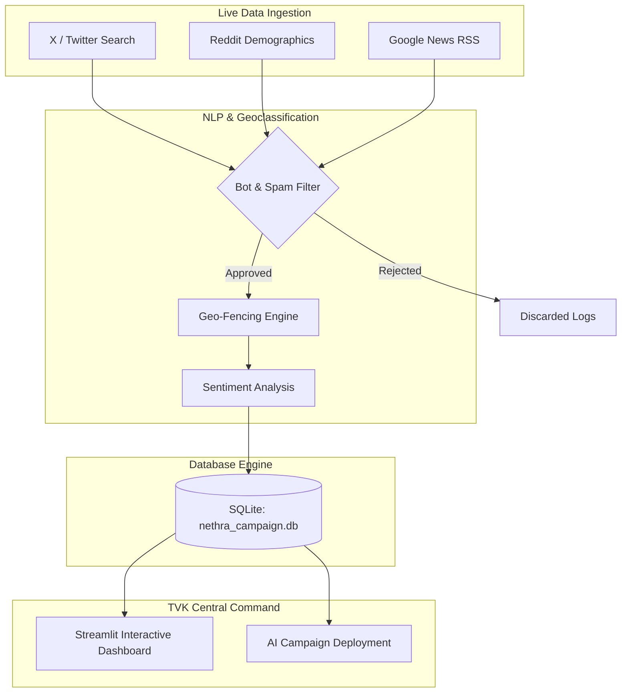

# 📖 TVK Nethra: System Architecture & Mathematical Whitepaper

This document provides a rigorous overview of the Nethra intelligence engine, detailing the underlying architecture, data pipelines, and the mathematical framework used to project political sentiment and render the strategic visualizations.

---

## 1. System Architecture & Data Pipeline
<a href="/?nav=Assembly" target="_self" style="background:#facc15;color:#450a0a;padding:4px 10px;border-radius:4px;text-decoration:none;font-weight:bold;font-size:0.8rem">🔙 Return to Dashboard</a>

Nethra operates on a dual-track architecture: a real-time ingestion pipeline and a highly governed SQLite inference engine. 

### Spam Block Rate & Data Quality Gate
The **Spam Block Rate** metric tracks the efficiency of the `SPAM` node. It filters out bot farm attacks, repetitive hashtag spam (>10/min), and commercial promotional noise to protect the integrity of the downstream mathematical models.

---

## 2. The Mathematical Engine: MRP & Behavioral Priors
<a href="/?nav=Assembly" target="_self" style="background:#facc15;color:#450a0a;padding:4px 10px;border-radius:4px;text-decoration:none;font-weight:bold;font-size:0.8rem">🔙 Return to Dashboard</a>

Nethra's core predictive capability relies on **Multilevel Regression and Poststratification (MRP)**. 
The baseline favorability for a demographic cell $c$ in region $i$ is calculated via public voter rolls (ensuring DPDP Act compliance):

$$
y_{ic} = \alpha_c + \beta X_{ic} + \epsilon_{ic}
$$

Where:
*   $\alpha_c$ is the fixed demographic effect.
*   $X_{ic}$ represents contextual region predictors.
*   $\epsilon_{ic}$ is irreducible error.

---

## 3. Geospatial Visualization Logic (The Map)
<a href="/?nav=Assembly" target="_self" style="background:#facc15;color:#450a0a;padding:4px 10px;border-radius:4px;text-decoration:none;font-weight:bold;font-size:0.8rem">🔙 Return to Dashboard</a>

The **Visual Map Command** plots constituencies using dynamic radius rendering. The visual size of the scatter marker is directly proportional to the total electorate scalar value of that unit ($V_u$).

$$
\text{Marker Size}_{u} = \log_{10}(V_u) \times k
$$

The choropleth color intensity represents the projected TVK Favorability fraction. Clicking any node instantly filters the sub-tabs by triggering a session state geospatial callback.

---

## 4. Competitor Favorability Breakdown (Bar Chart)
<a href="/?nav=Assembly" target="_self" style="background:#facc15;color:#450a0a;padding:4px 10px;border-radius:4px;text-decoration:none;font-weight:bold;font-size:0.8rem">🔙 Return to Dashboard</a>

This chart visualizes the real-time erosion or growth of party bases. It calculates the final projected vote share $P(\text{Vote}_{P})$ for party $P$ by applying NLP **Behavioral Psychology Modifiers ($\gamma$)** directly to the MRP baseline.

$$
P(\text{Vote}_{P}) = \text{Baseline}_{MRP} \times (1 + \gamma_{\text{sentiment}} + \gamma_{\text{salience}})
$$

If DMK suffers a severe negative event (e.g., local flooding outrage), their $\gamma_{\text{sentiment}}$ becomes highly negative, immediately depressing their bar height while boosting TVK's bar dynamically via a zero-sum re-weighting matrix.

---

## 5. The Salience Deficit Equation (Messaging Gap)
<a href="/?nav=Assembly" target="_self" style="background:#facc15;color:#450a0a;padding:4px 10px;border-radius:4px;text-decoration:none;font-weight:bold;font-size:0.8rem">🔙 Return to Dashboard</a>

The **Messaging Salience Gap** chart is the most critical strategic tool on the dashboard. It calculates the delta between what issues the electorate is discussing versus what the TVK digital campaign is publishing.

$$
\text{Salience Deficit} = \sum (\text{Voter Demand Volume}) - \sum (\text{TVK Digital Output Volume})
$$

*   **Positive Deficit (Blue Bar > Yellow Bar):** Indicates a blind spot. The public is highly concerned about an issue, but TVK is ignoring it.
*   **Negative Deficit (Yellow Bar > Blue Bar):** Indicates messaging saturation. TVK is over-campaigning on an issue the public cares less about.

---

## 6. Time-Series Trajectory Calculus (Trend Lines)
<a href="/?nav=Assembly" target="_self" style="background:#facc15;color:#450a0a;padding:4px 10px;border-radius:4px;text-decoration:none;font-weight:bold;font-size:0.8rem">🔙 Return to Dashboard</a>

The 8-week trajectory line charts do not display raw noisy daily data. Instead, Nethra applies an **Exponential Moving Average (EMA)** to smooth out daily social media spikes (e.g., a viral video) while maintaining sensitivity to true structural shifts in momentum.

$$
S_{t} = \lambda \cdot (\text{NLP Score}_t) + (1 - \lambda) \cdot S_{t-1}
$$

Where $\lambda$ (the smoothing factor) is dynamically calibrated based on the volume of daily data ingested.

---

## 7. NLP Extraction & Confidence
<a href="/?nav=Assembly" target="_self" style="background:#facc15;color:#450a0a;padding:4px 10px;border-radius:4px;text-decoration:none;font-weight:bold;font-size:0.8rem">🔙 Return to Dashboard</a>

The **NLP Confidence** metric displayed on the Ground Truth tab measures the probabilistic certainty of the Multi-Class Topic Classifier when extracting the "Top Priority Issue" from unstructured Tamil text blocks. A score >85% guarantees multi-source corroboration (news + social chatter).

   
