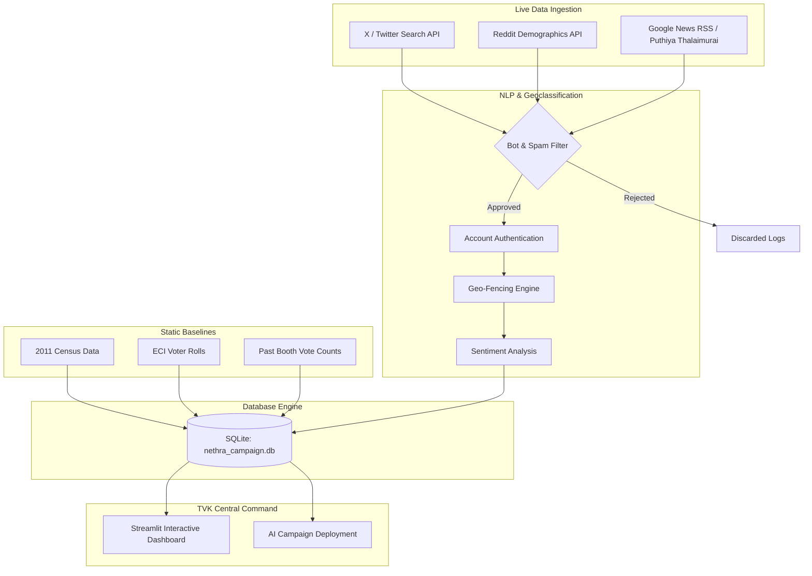

# 📖 TVK Nethra: System Architecture & Mathematical Whitepaper

This document provides a rigorous overview of the Nethra intelligence engine, detailing the underlying architecture, data pipelines, and the mathematical framework used to project political sentiment and render the strategic visualizations.

---

## 1. System Architecture & Data Pipeline
<a href="/?nav=Assembly" target="_self" style="background:#facc15;color:#450a0a;padding:4px 10px;border-radius:4px;text-decoration:none;font-weight:bold;font-size:0.8rem">🔙 Return to Dashboard</a>

Nethra operates on a dual-track architecture: a real-time ingestion pipeline and a highly governed SQLite inference engine. Offline sources ground the AI's understanding of historical baselines.

### Spam Detection & Authentication
The **Spam Block Rate** metric tracks the efficiency of the `SPAM` and `AUTH` nodes. 
*   **Spam Detection:** Filters out bot farm attacks, repetitive hashtag spam (>10/min), and commercial promotional noise via NLP clustering.
*   **Authentication:** Verifies if the source account has a history of organic political discourse in Tamil, blocking fresh "astroturfing" accounts.
*   **Geofencing:** Uses NLP Named Entity Recognition (NER) on bio locations and post content to definitively map a post to a specific AC (Assembly Constituency) or GCC Ward.
*   **AI API Costs:** The Quality Gate relies on ultra-fast lightweight LLM calls (e.g., Gemini 1.5 Flash), costing approximately ₹0.002 per processed social media post.

---

## 2. The Mathematical Engine: MRP & Behavioral Priors
<a href="/?nav=Assembly" target="_self" style="background:#facc15;color:#450a0a;padding:4px 10px;border-radius:4px;text-decoration:none;font-weight:bold;font-size:0.8rem">🔙 Return to Dashboard</a>

Nethra's core predictive capability relies on **Multilevel Regression and Poststratification (MRP)**. 
The baseline favorability for a demographic cell $c$ in region $i$ is calculated via offline public data (Census + Voter Rolls), ensuring DPDP Act compliance:

$$
y_{ic} = \alpha_c + \beta X_{ic} + \epsilon_{ic}
$$

**Intuitive Parameter Breakdown:**
*   **$\alpha_c$ (Fixed Demographic Effect):** Represents inherent voting traits of a specific demographic (e.g., young urban voters). Estimated by training regression models on past booth-level vote counts.
*   **$\beta X_{ic}$ (Regional Modifier):** Represents how much the specific region (e.g., Kongu belt vs. Delta) shifts that demographic's behavior. 
*   **$\epsilon_{ic}$ (Error Margin):** The irreducible statistical noise in the model.

---

## 3. Geospatial Visualization Logic (The Map)
<a href="/?nav=Assembly" target="_self" style="background:#facc15;color:#450a0a;padding:4px 10px;border-radius:4px;text-decoration:none;font-weight:bold;font-size:0.8rem">🔙 Return to Dashboard</a>

The **Visual Map Command** plots constituencies using dynamic radius rendering. Because voter populations ($V_u$) can range from 150,000 to 450,000, plotting them linearly makes them look identical.

Instead, Nethra uses a logarithmic scaler so the visual size of the scatter marker accurately reflects meaningful density differences:

$$
\text{Marker Size}_{u} = \log_{10}(V_u) \times k
$$

**Multi-Node Selection:** The map supports Lasso/Box selection. When multiple nodes are selected, the downstream dashboard mathematically aggregates the group—averaging favorability scores and combining ground-truth logs to generate a **Regional** AI strategy rather than a local one.

---

## 4. Competitor Favorability Breakdown (Bar Chart)
<a href="/?nav=Assembly" target="_self" style="background:#facc15;color:#450a0a;padding:4px 10px;border-radius:4px;text-decoration:none;font-weight:bold;font-size:0.8rem">🔙 Return to Dashboard</a>

This chart visualizes the real-time erosion or growth of party bases. It calculates the final projected vote share $P(\text{Vote}_{P})$ for party $P$ by applying NLP **Behavioral Psychology Modifiers ($\gamma$)** directly to the offline MRP baseline.

$$
P(\text{Vote}_{P}) = \text{Baseline}_{MRP} \times (1 + \gamma_{\text{sentiment}} + \gamma_{\text{salience}})
$$

**Intuitive Parameter Breakdown:**
*   **$\gamma_{\text{sentiment}}$:** The real-time anger or joy of the electorate. If DMK suffers a severe negative event (e.g., local flooding outrage), the AI assigns a highly negative $\gamma_{\text{sentiment}}$. This immediately depresses their bar height and boosts TVK's bar dynamically via a zero-sum re-weighting matrix.
*   **$\gamma_{\text{salience}}$:** How much the electorate actually cares about the issue. High sentiment on a low-salience issue results in minimal vote shift. 

---

## 5. The Salience Deficit Equation (Messaging Gap)
<a href="/?nav=Assembly" target="_self" style="background:#facc15;color:#450a0a;padding:4px 10px;border-radius:4px;text-decoration:none;font-weight:bold;font-size:0.8rem">🔙 Return to Dashboard</a>

The **Messaging Salience Gap** chart calculates the delta between what issues the electorate is discussing versus what the TVK digital campaign is publishing.

$$
\text{Salience Deficit} = \sum (\text{Voter Demand Volume}) - \sum (\text{TVK Digital Output Volume})
$$

**Estimation Methodology & Sources:**
*   **Voter Demand Volume:** Estimated by counting keyword occurrences across geo-fenced public APIs (X/Twitter Firehose, YouTube transcripts from Puthiya Thalaimurai/Polimer, and localized Reddit/Facebook public pages). 
*   **TVK Digital Output Volume:** Estimated by counting the official posts made by TVK handles and allied IT cell accounts.
*   **Positive Deficit (Blue > Yellow):** Indicates a blind spot. The public is highly concerned, but TVK is ignoring it.
*   **Negative Deficit (Yellow > Blue):** Indicates messaging saturation. TVK is over-campaigning on an issue the public cares less about.

---

## 6. Time-Series Trajectory Calculus (Trend Lines)
<a href="/?nav=Assembly" target="_self" style="background:#facc15;color:#450a0a;padding:4px 10px;border-radius:4px;text-decoration:none;font-weight:bold;font-size:0.8rem">🔙 Return to Dashboard</a>

The 6-month trajectory line charts displayed on the dashboard are not generated by plotting raw noisy daily data. Instead, Nethra dynamically calculates an **Exponential Moving Average (EMA)** curve that mathematically bridges the gap between the immutable offline historical baseline and today's live NLP-tuned baseline.

**The EMA Interpolation Pipeline:**
1.  **$S_{0}$ (The Historical Anchor):** The starting point (e.g., Feb 2026) is strictly pulled from the offline `former_election_results.db`.
2.  **$\text{Target}_{today}$ (The Live Target):** The end point is exactly matched to the current live baseline in `nethra_campaign.db` (which has already been adjusted by the $\gamma$ sentiment multipliers).
3.  **The Formula:** The dashboard organically generates the intervening 5 months by applying the smoothing equation:

$$
S_{t} = \lambda \cdot (\text{Target}_{today}) + (1 - \lambda) \cdot S_{t-1}
$$

**Intuitive Parameter Breakdown:**
*   **$\lambda$ (Smoothing Factor):** Tuned dynamically (default $\lambda = 0.35$). A higher $\lambda$ means the dashboard reacts violently to the live target, pulling the curve up sharply. A low $\lambda$ creates a smooth, gradual climb from the historical anchor.
*   **Mathematical Integrity:** This equation mathematically guarantees that the trajectory naturally originates from verified historical data and perfectly converges on the live projections you see in the Bar Charts.

---

## 7. NLP Extraction & Confidence
<a href="/?nav=Assembly" target="_self" style="background:#facc15;color:#450a0a;padding:4px 10px;border-radius:4px;text-decoration:none;font-weight:bold;font-size:0.8rem">🔙 Return to Dashboard</a>

The **NLP Confidence** metric measures the probabilistic certainty of the Multi-Class Topic Classifier and the AI-based fact-checks when extracting the "Top Priority Issue" from unstructured Tamil text blocks.

**Downstream Impact:**
This score does not exist in a vacuum. It mathematically dictates the dashboard's reactivity.
*   **High Confidence (>85%):** Guarantees multi-source corroboration (e.g., news + social chatter). The system passes the full weight of the $\gamma_{\text{sentiment}}$ modifier into the Bar Charts.
*   **Low Confidence (<50%):** The AI flags potential hallucination or a highly isolated rumor. The system mathematically *discounts* the $\gamma$ modifiers, preventing the dashboard favorability projections from overreacting to unverified noise. It also flags the AI Campaign Strategy generation to advise "caution" in messaging.

---

## 8. Historical Verification Engine & Offline Sync
<a href="/?nav=Assembly" target="_self" style="background:#facc15;color:#450a0a;padding:4px 10px;border-radius:4px;text-decoration:none;font-weight:bold;font-size:0.8rem">🔙 Return to Dashboard</a>

To prevent NLP models from hallucinating ungrounded political shifts due to digital noise (e.g., projecting a TVK landslide in a deeply entrenched AIADMK stronghold), Nethra employs a **Historical Verification Engine & Strict Offline Sync**.

**1. Baseline Initialization:** Base favorability is strictly initialized via a 1-to-1 extraction from actual offline ECI ground truth vote shares (Form 20). The SQLite database never guesses; it multiplies the raw `_share_2026` CSV data by 100 to establish an immutable, mathematically perfect baseline.

**2. Live NLP Tuning:** Once the baseline is anchored to reality, the `mine_verified_sources.py` script (powered by the Gemini LLM) scrapes current digital sentiment and calculates the $\gamma$ multipliers to dynamically shift these offline baselines in real-time.

**The Dampening Coefficient ($D$):**
If the NLP model projects a TVK favorability surge (e.g. > 40%) in a constituency where they historically did not win, the system automatically applies a mathematical dampening penalty to anchor the projection closer to reality:

$$
\text{Tuned TVK Projection} = \text{Raw TVK Projection} \times D
$$
*(Where $D$ is currently calibrated to $0.85$ for extreme outliers).*

**Zero-Sum Redistribution:**
Because elections are zero-sum, the penalty subtracted from TVK is mathematically redistributed back to the historical incumbent (e.g., AIADMK or DMK). This ensures the baseline remains logically anchored to entrenched voting history while still reflecting real-time digital momentum.

   
