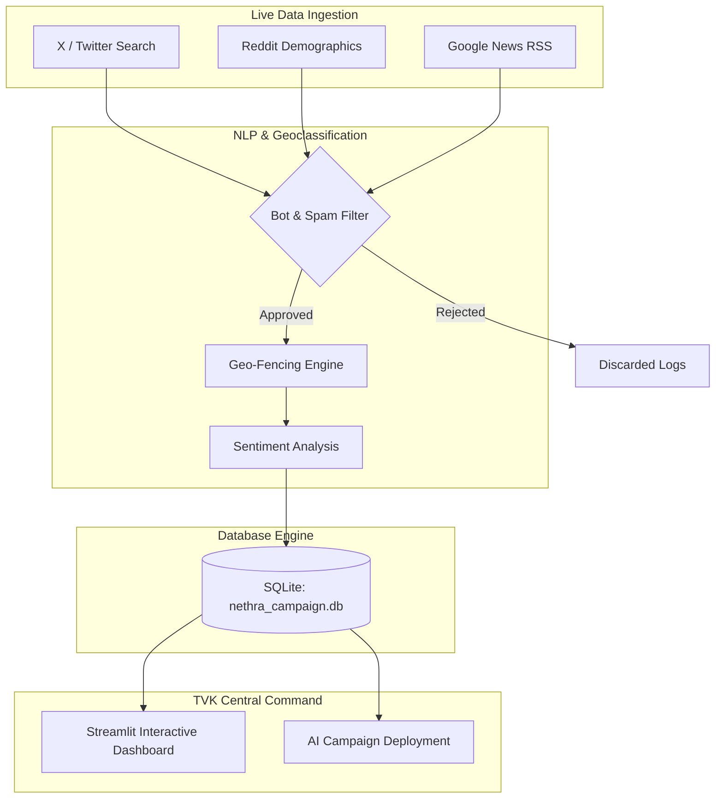

# 📖 TVK Nethra: System Architecture & Mathematical Whitepaper

This document provides a rigorous overview of the Nethra intelligence engine, detailing the underlying architecture, data pipelines, and the mathematical framework used to project political sentiment.

---

## 1. System Architecture & Data Pipeline
<a href="/?nav=Assembly" target="_self" style="background:#facc15;color:#450a0a;padding:4px 10px;border-radius:4px;text-decoration:none;font-weight:bold;font-size:0.8rem">🔙 Return to Dashboard</a>

Nethra operates on a dual-track architecture: a real-time ingestion pipeline and a highly governed SQLite inference engine. 

### Spam Block Rate & Data Quality Gate
The **Spam Block Rate** metric tracks the efficiency of the `SPAM` node in the architecture above. It filters out bot farm attacks, repetitive hashtag spam (>10/min), and commercial promotional noise to protect the integrity of the sentiment scores.

---

## 2. The Mathematical Engine: MRP & Behavioral Priors
<a href="/?nav=Assembly" target="_self" style="background:#facc15;color:#450a0a;padding:4px 10px;border-radius:4px;text-decoration:none;font-weight:bold;font-size:0.8rem">🔙 Return to Dashboard</a>

Nethra's core predictive capability relies on **Multilevel Regression and Poststratification (MRP)**, augmented by behavioral psychology modifiers. 

### The Demographic Baseline (MRP)
The primary goal is to project booth-level swing counts using the MRP framework. The model operates on demographic counts from public voter rolls to ensure 100% DPDP Act compliance. The baseline favorability for a demographic cell $c$ in region $i$ is calculated as:

$$
y_{ic} = \alpha_c + \beta X_{ic} + \epsilon_{ic}
$$

Where:
*   $\alpha_c$ is the fixed effect for the demographic cell (age, caste proxy, occupation).
*   $X_{ic}$ represents contextual region-level predictors (e.g., historical vote share).
*   $\epsilon_{ic}$ is the irreducible error.

### Behavioral Psychology Modifiers ($\gamma$)
Psychology is integrated into the regression model as **Mathematical Priors**. The raw **Statewide Favorability** and hyper-local **NLP Confidence** scores act as quantifiable traits (multipliers $\gamma$) that adjust the demographic baseline in real-time based on live social media extraction.

$$
P(\text{Vote}_{TVK}) = \text{Baseline}_{MRP} \times (1 + \gamma_{\text{sentiment}} + \gamma_{\text{salience}})
$$

This dual approach ensures mathematical precision at the demographic level, while remaining highly responsive to volatile campaign events (like rallies or local crises).

---

## 3. NLP Confidence & Topic Salience
<a href="/?nav=Assembly" target="_self" style="background:#facc15;color:#450a0a;padding:4px 10px;border-radius:4px;text-decoration:none;font-weight:bold;font-size:0.8rem">🔙 Return to Dashboard</a>

The **NLP Confidence** score measures the probabilistic certainty of the NLP engine when extracting a "Top Priority Issue" (e.g., Water Drainage, MSME Taxes) from unstructured Tamil text. 
A score of >85% indicates strong, multi-source corroboration across Twitter, News, and local forums. 

The **Messaging Salience Gap** (shown in the dashboard's bar charts) represents the mathematical difference between the voter's concern frequency (Voter Priority %) and the TVK party's current digital output (TVK Messaging %). 

$$
\text{Gap} = \sum (\text{Voter Frequency}) - \sum (\text{TVK Campaign Frequency})
$$

---

   
