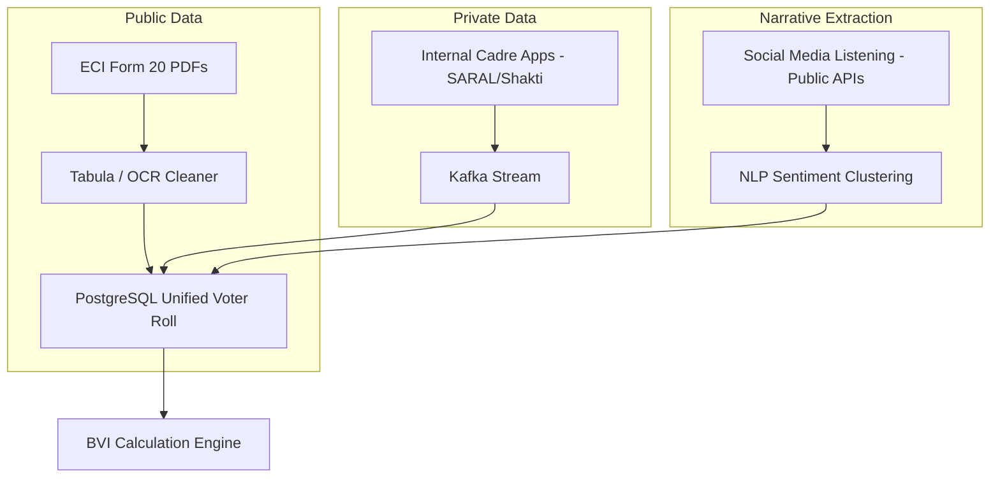

# Data Engineering & Simulation Strategy

## 1. Prototype Strategy: Mock Data First
To ensure a rapid BD cycle with **Gemini-CLI**, we bypass all complex ETL (Extract, Transform, Load) pipelines for the Phase 1 prototype. 

**Action:** We will generate a single, high-fidelity CSV file (`mock_constituencies.csv`) that represents the *output* of the proposed production pipeline. 

### `mock_constituencies.csv` Schema:
| Column | Description |
| :--- | :--- |
| `id` | Constituency / Booth ID |
| `lat` / `lon` | Geographic coordinates for mapping |
| `swing_voter_est` | Estimated number of swing voters |
| `swing_voter_pct` | Density percentage (powers the heatmap) |
| `top_issue_1` | Primary local grievance (e.g., "Youth Jobs") |
| `top_issue_2` | Secondary local grievance (e.g., "Water Supply") |
| `cadre_report_val` | The "fake" report from local workers (for anomaly demo) |
| `historical_baseline` | The ECI truth (for anomaly demo) |

## 2. Production Architecture (The IT Cell Pitch)
When presenting to the party's IT cell, we showcase the scalable vision for ingesting real-world data:

## 3. Data Acquisition Strategy (Production)
*   **Historical Accuracy:** Mirroring ECI data from state CEO portals, parsed using automated Python scrapers.
*   **Identity Resolution:** Using SHA-256 client-side hashing on voter phone numbers to allow matching against Meta Custom Audiences without exposing raw PII.
*   **Data Sovereignty:** A clear technical mandate that the political client maintains 100% legal ownership of the raw datasets. 
*   **Lifecycle:** Automated "Lifecycle Hook" that cryptographically shreds all PII data 7 days post-election.
