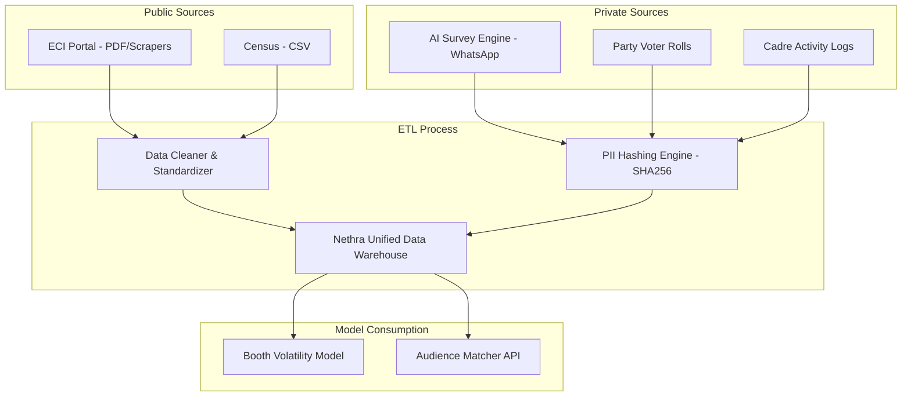

# Data Engineering & Simulation Strategy

## 1. Data Ingestion Pipeline


## 2. Core Data Schemas

### Booth History (Public Data)
```json
{
    "booth_id": "TN-234-001",
    "district": "Tiruchirappalli",
    "historical_results": [
        {"year": 2026, "winner": "TVK", "margin_percent": 8.7}
    ]
}
```

### Voter Sentiment Profile (Private/Simulated Data)
```json
{
    "phone_hash": "e3b0c44298fc1c149afbf4c8996fb92427ae41e4649b934ca495991b7852b855",
    "sentiment_score": -0.65,
    "swing_probability": 0.82
}
```

## 3. Data Mirroring & Simulation
- **Public Data Mirroring:** Stored in `/data/public/` parsed from ECI PDFs.
- **Private Data Simulation:** Uses a **Synthetic Voter Engine** with Stochastic Distribution and "Viral Issue Models" to generate believable test data.
