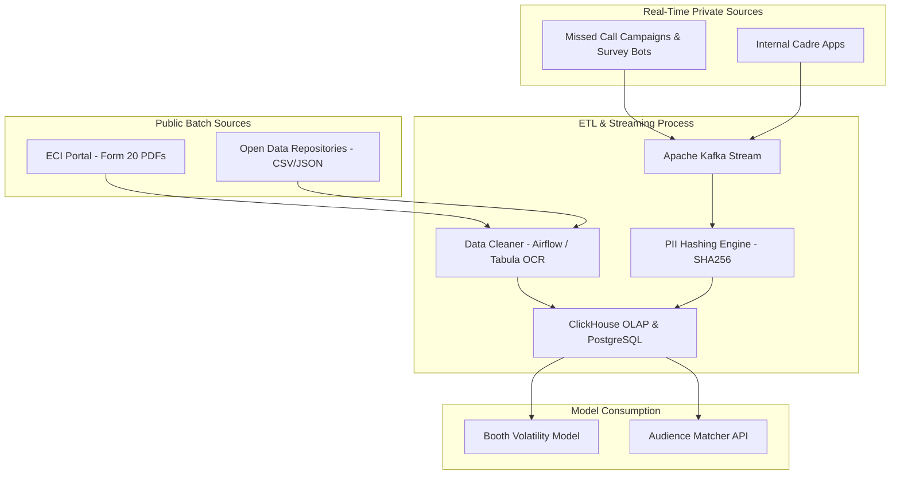

# Data Engineering & Simulation Strategy

## 1. Data Ingestion Pipeline (Streaming & Batch)
Nethra requires a robust, dual-pipeline architecture. Batch processing handles historical public data, while real-time streaming handles the high-velocity influx of private cadre and survey data.



## 2. Public Data Acquisition (Ground Truth)
Obtaining clean booth-level data in India is historically difficult due to reliance on PDFs. Nethra utilizes a multi-pronged approach:

*   **Primary Source:** Election Commission of India (ECI) and State CEO websites. The critical document is **"Form 20"**, which details the final vote count per booth.
*   **Open Data Repositories:** To accelerate ingestion, Nethra pulls from community-cleaned repositories such as **DataMeet (GitHub)**, **OpenCity.in**, and **Justice Hub**.
*   **Academic Sources:** For longitudinal booth volatility over the last 3 election cycles, we integrate datasets from the **Harvard Dataverse** (e.g., India National and State Election Dataset) and Ashoka University's **TCPD**.
*   **Extraction Tools:** Raw PDFs from state portals are processed using **Tabula** (for table extraction) and the open-source **`in-rolls`** utility to standardize into machine-readable Parquet formats.

## 3. Private Data Sources (The Political Reality)
Indian political IT cells possess highly sophisticated, granular data. Nethra integrates with these existing ecosystems:

*   **Missed Call Campaigns (Top-of-Funnel):** The primary mechanism for mass phone number harvesting. Voters leave a missed call on a toll-free number to register complaints or join the party, providing Nethra with a verified phone number for the Custom Audience matcher.
*   **Internal Cadre Apps (The "ERP" of Politics):** Nethra connects via API to proprietary apps (similar to BJP's SARAL or Congress's Shakti). These apps provide granular, door-to-door data including:
    *   **Caste & Religion Demographics** (crucial for local narrative tuning).
    *   **Labharthi (Beneficiary) Status:** Identifies if a household receives specific government welfare schemes (e.g., PM-Kisan, free laptops).
*   **WhatsApp Pramukh Mapping:** Data mapping local volunteers ("Pramukhs") to specific booth-level WhatsApp groups, allowing us to track the penetration of our generated narratives.

## 4. Core Data Schemas

### Voter Sentiment Profile (Streaming Event via Kafka)
```json
{
    "event_id": "evt_99823",
    "phone_hash": "e3b0c442...",
    "booth_id": "TN-234-001",
    "beneficiary_status": ["scheme_housing", "scheme_ration"],
    "nlp_intent": "COMPLAINT_INFRASTRUCTURE",
    "sentiment_score": -0.65,
    "confidence_score": 0.89,
    "timestamp": "2026-05-18T10:00:23Z",
    "source": "MISSED_CALL_SURVEY"
}
```

## 5. Data Lifecycle & Compliance
*   **Post-Election Purge:** Political clients are highly sensitive about data leaks. The engineering pipeline includes an automated "Lifecycle Hook" that cryptographically shreds all PII and hashed phone mapping tables 7 days post-election, retaining only anonymized, aggregated booth-level insights.
*   **Over-Optimism Bias Simulation:** To test our anomaly detection models before deployment, our synthetic data engine intentionally injects "Over-Optimism Bias" (inflating support by +40%) into 15% of the simulated cadre reports.
