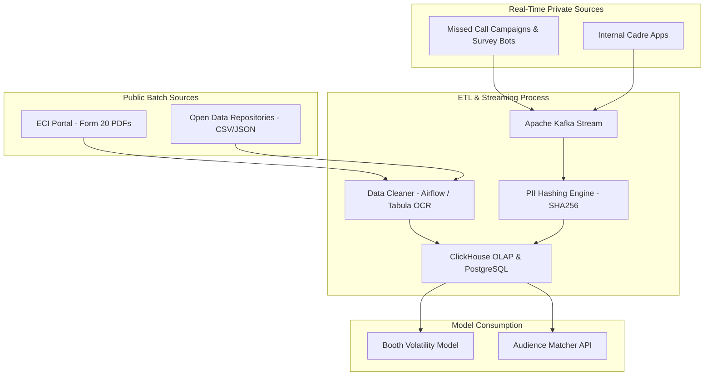

# Data Engineering & Simulation Strategy

## 1. Data Ingestion Pipeline (Streaming & Batch)

## 2. Public Data Acquisition Strategy
- **Official Source:** Election Commission of India (ECI) **Form 20**.
- **Community Aggregators:** **DataMeet (GitHub)**, **OpenCity.in**, and **Harvard Dataverse**.
- **Handling PDF Brittleness:** 
    - Pipeline uses **Tabula-py** and AWS Textract for OCR.
    - **HITL (Human-in-the-Loop):** Failed parsings are sent to a dedicated triage queue for manual data entry by 15-member verification teams.

## 3. Private Data Ecosystems
- **Cadre App Integration:** Direct API hooks for apps like *SARAL* or *Shakti*.
- **Data Points:**
    - **Caste/Religion:** Primary indicators for social engineering.
    - **Labharthi (Beneficiary) Status:** Maps households to welfare schemes (Housing, Food, Health).
- **Missed Call Tunnelling:** Automated ingestion of phone numbers from missed-call service providers into the Kafka "Top-of-Funnel" topic.

## 4. Data Lifecycle & Ownership
- **Mandate:** The Political Party retains 100% legal ownership of the raw data. Nethra owns the analytical weights and model code.
- **Lifecycle Hook:** Automated cryptographic shredding (using AES-256 key destruction) of all PII and hashed mapping tables 7 days post-election.
- **Serialization:** Uses **Protobuf** for Kafka message schemas to ensure strict data validation across producers (Survey bots) and consumers (Analytics models).

## 5. Anomaly Simulation (Testing)
To validate the **Anomaly Detector**, our synthetic data engine injects:
- **"Over-Optimism Bias":** Inflating support scores by +40% for 15% of records.
- **"Duplicate Injection":** Simulating a volunteer submitting the same report multiple times to "pad" activity metrics.
