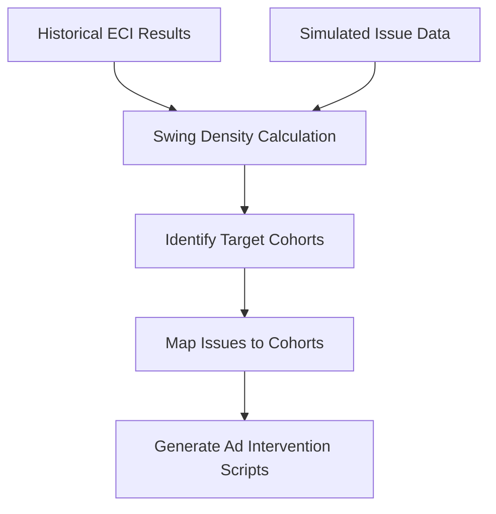

# Nethra: The Mathematical Foundation

## 1. The Core Objective: Swing Voter Density
The essence of the Nethra model is to locate the "Moveable Middle." The primary output is the **Swing Voter Density ($S_d$)** per booth/constituency.

### Prototype Implementation: The Heuristic Model
For the Phase 1 prototype, we use a simplified heuristic formula applied to our static mock data to calculate believable swing estimates for the dashboard.

$$ S_d = (\alpha \cdot M_{vol}) + (\beta \cdot I_{salience}) $$

- **$M_{vol}$ (Historical Volatility):** Calculated from ECI Form 20 data (1 - victory margin). A thin margin suggests high volatility.
- **$I_{salience}$ (Issue Saliency):** A weight assigned to the intensity of local issues (e.g., how often "Youth Unemployment" is discussed in local digital circles).
- **$S_d$:** The resulting density (0-1), which determines the color intensity of the hex-bin map.

## 2. Issue Mapping & Influence Potential
Once the swing population is identified, we map them to **Influence Topics**.

## 3. Causal Inference: The ROI Narrative (The Pitch)
To prove to political clients that Nethra actually wins elections, we sell the concept of **Synthetic Control.**

- **The Logic:** We compare a booth where Nethra ads were active (Treatment) against a mathematically constructed "Twin Booth" (Control) that was identical in demographics and historical margins but did not receive the ads.
- **The Result:** The difference in vote share between the two is the **Causal Impact** of the AI campaign.

## 4. Anomaly Detection (Dirty Data)
Political cadre often inflate their success reports.
- **Prototype:** We flag specific booths where cadre reports (90% support) contradict the historical baseline (40% support).
- **Production:** Uses **Isolation Forest** algorithms to detect multi-dimensional outliers in reporting, ensuring the party leadership sees the "Ground Truth."
