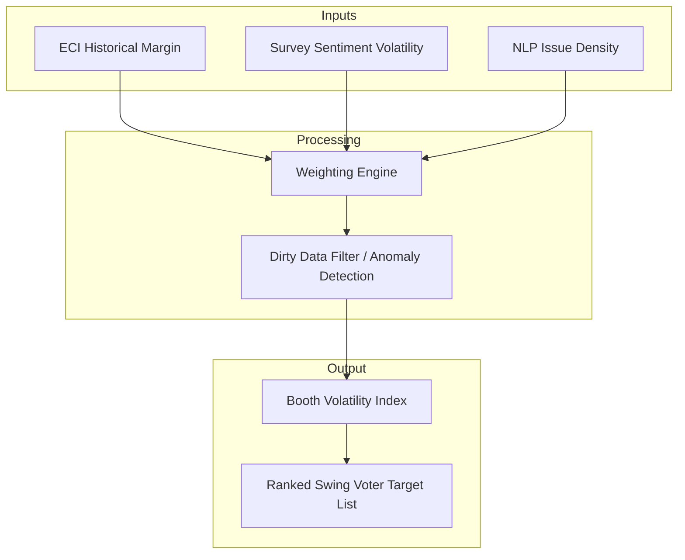
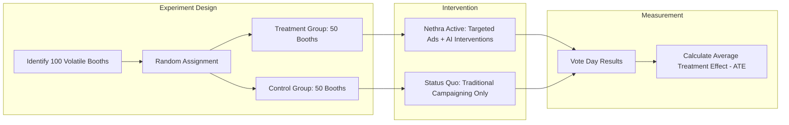

# Nethra: The Mathematical Foundation

## 1. The Booth Volatility Index (BVI)
The BVI is a composite score (0 to 1.0) calculated for every polling booth.

$$ BVI = \alpha \cdot M_{hist} + \beta \cdot S_{vol} + \gamma \cdot I_{unrest} $$

- **$M_{hist}$ (Historical Margin):** Normalized historical victory margin.
- **$S_{vol}$ (Sentiment Volatility):** Variance in sentiment over a 30-day window from AI surveys.
- **$I_{unrest}$ (Issue Unrest):** Density of specific local grievances compared to regional averages.

## 2. The "Dirty Data" Anomaly Detection
Nethra uses a Cross-Validation Model to penalize cadre data that significantly deviates from AI survey engine ground-truth.

## 3. Causal Inference & ROI Verification
To prove ROI, Nethra employs a **Control vs. Treatment** methodology at the booth level.

$$ ATE = E[Y_1 - Y_0] $$

## 4. Swing Voter Clustering
Using K-Means clustering on multidimensional sentiment vectors to identify the "Psychological Profile" of the swing voter for content generation.
