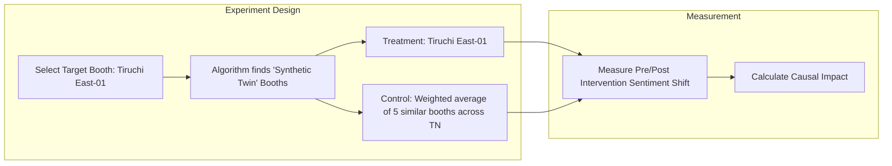

# Nethra: The Mathematical Foundation

## 1. The Booth Volatility Index (BVI)
The BVI is a composite score (0 to 1.0) calculated for every polling booth. 

*Political Translation:* For party leadership, the BVI is simply presented as the **"ROI Score."** High BVI means spending ₹100 here will likely flip 5 votes. Low BVI means ₹100 will flip 0 votes.

$$ BVI = \alpha \cdot M_{hist} + \beta \cdot S_{vol} + \gamma \cdot I_{unrest} $$

- **$M_{hist}$ (Historical Margin):** Normalized historical victory margin.
- **$S_{vol}$ (Sentiment Volatility):** Variance in sentiment over a 30-day window.
- **$I_{unrest}$ (Issue Unrest):** Density of local grievances compared to regional averages.

## 2. The "Dirty Data" Anomaly Detection
Party workers often inflate support numbers to please their bosses. Nethra does not use hardcoded thresholds to catch this.
- **Algorithm:** We utilize **Isolation Forests** and **Autoencoders**. The model is trained on the baseline of historical + AI Survey data. When a cadre report (e.g., "95% support in my street") is ingested, it is projected into this multidimensional space. If it falls outside the expected variance cluster, it is flagged as an anomaly, and its weight in the BVI is severely downgraded.

## 3. Causal Inference & ROI Verification
Simple A/B testing fails in politics due to the **Spillover Effect** (a voter in a treatment booth receives an ad and WhatsApps it to a cousin in a control booth).

### Advanced Methodology: Synthetic Control / Difference-in-Differences
Instead of randomized individual control, we use **Synthetic Control Methods**.

By comparing the targeted booth against a mathematically constructed "synthetic twin" that shares its exact historical and demographic profile, we isolate the true causal impact of the Nethra ad intervention.

## 4. Swing Voter Clustering
Using DBSCAN/K-Means clustering on multidimensional sentiment vectors to identify the "Psychological Profile" of the swing voter (e.g., "Aspirational Youth", "Disgruntled Pensioner") to dictate the exact tone of the generated video scripts.
