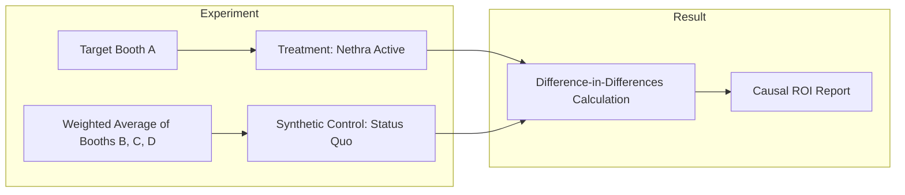

# Nethra: The Mathematical Foundation

## 1. The Booth Volatility Index (BVI) / Opportunity Score
For party leadership, the BVI is presented as the **"Opportunity Score"** (0-10).

$$ BVI = \alpha \cdot M_{hist} + \beta \cdot S_{vol} + \gamma \cdot I_{unrest} $$

### Feature Vector Components:
- **$M_{hist}$:** ECI Margin (1 - [Winner_Vote_Share - RunnerUp_Vote_Share]).
- **$S_{vol}$:** Variance of sentiment across the survey demographic in the last 14 days.
- **$I_{unrest}$:** Count of unique local grievance entities extracted via NLP, normalized per 1,000 voters.

## 2. Anomaly Detection: Anomaly (Dirty Data) Detector
To catch "Over-Optimism Bias" (fabricated cadre reports):
- **Model:** **Isolation Forest** (scikit-learn implementation).
- **Features:** Reported Support %, Historical Support %, Local Survey Sentiment, Interaction Frequency.
- **Threshold:** Anomalies (Score < -0.75) are automatically flagged, and the cadre report is discarded or severely down-weighted in the BVI calculation.

## 3. Causal Inference: ROI Measurement
To solve the **"Spillover Effect"** (ads reaching the control group), we use **Synthetic Control Methods**.

### Library: `CausalImpact` (Python/R)
Instead of a random control booth in the same district, we build a **"Synthetic Twin"** using a weighted average of booths from *other* districts that share identical demographics and historical voting patterns but are not exposed to the ad campaign.

## 4. The "Business Case" ROI Example
**Booth #210 (Targeted):**
- **Spend:** ₹12,000 (Targeted Reels + WhatsApp).
- **Causal Swung Votes:** +182 (Determined via Synthetic Control).
- **Cost Per Vote (CPV):** **₹66**.

**Traditional Rally (Comparison):**
- **Estimated CPV:** **₹500 - ₹800** (Logistics, food, transportation, venue).

*Conclusion:* Nethra is ~8x more efficient at securing the marginal vote required for victory.
