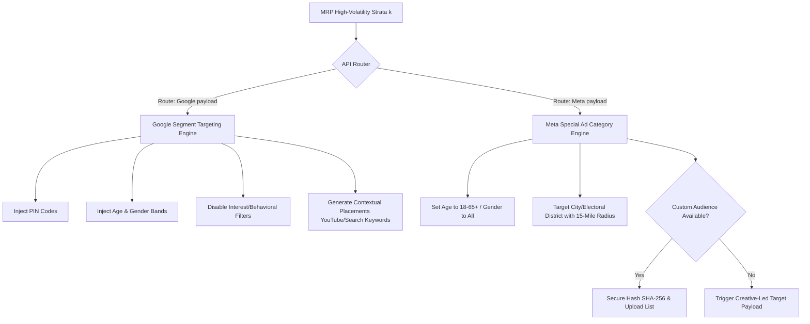

# Nethra: Political Advertising Compliance & Targeting Framework (2026 Rules)

This document establishes the strategic compliance protocols and platform-native boundaries for Project **Nethra's** targeting engine across Google and Meta. It directly addresses the 2026 regulatory landscapes for political, electoral, and social issue advertising in India/Asia, ensuring absolute legal compliance with the **DPDP Act 2023** and the **Election Commission of India (ECI)** guidelines, while maximizing Campaign ROI.

---

## 1. Executive Summary: The Modern Targeting Paradox

Political advertising in 2026 is defined by a strict dual-platform paradox: **highly precise predictions generated on the backend (MRP) must be translated into broad, privacy-compliant parameter sets on the frontend (Ad APIs).**

Both Google and Meta have systematically dismantled the capability to natively micro-target individuals based on political affinity, religion, caste, or micro-geography. Attempting to bypass these blocks with "gray-hat" methods triggers immediate, machine-learning-driven platform bans and severe legal risks under the ECI's Voluntary Code of Ethics.

To maintain **Track 1 (The ML Prototype)** and **Track 2 (The Production Vision)** execution, Nethra employs a **Compliant Translation Layer** that maps high-probability demographic strata ($k$) onto permitted targeting frameworks, utilizing **Contextual Placements** on Google and **Custom Audiences & Creative-Led Self-Selection** on Meta.

---

## 2. Platform-Specific Targeting Limitations (2026 Core Rules)

| Targeting Dimension | Google (Search, Display, YouTube) | Meta (Facebook, Instagram, Threads) |
| :--- | :--- | :--- |
| **Special Category Designation** | **Election Ads (India)** | **Social Issues, Elections, or Politics (SIEP)** |
| **Age Groupings** | **Permitted** (Any range $\ge 18$) | **Restricted to 18–65+** (No narrowing allowed) |
| **Gender Targeting** | **Permitted** (Male, Female, All) | **Strictly Prohibited** (Must include all genders) |
| **Economic / Financial Status** | **Strictly Blocked** (No income proxies or behavioral categories) | **Strictly Blocked** (No income proxies or financial behaviors) |
| **Religion / Caste / Sensitive Demographics** | **Complete Block** (Automated flagging & suspension) | **Complete Block** (Automated flagging & suspension) |
| **Geographic Location** | **Permitted to PIN Code level** (Postal code allowed; Radius targeting strictly blocked) | **PIN/ZIP Code Blocked** (Broader state/city/electoral district; min 15-mile/25km radius; no exclusions) |

### Detailed Targeting Analysis:

#### 1. Age Restrictions
*   **Google:** Allows advertisers to select specific age bands (e.g., 18-24, 25-34) to target or exclude.
*   **Meta:** The SIEP Special Ad Category strictly locks the age selector to **18-65+**. Attempting to narrow this range natively will result in ad set rejection.

#### 2. Gender Restrictions
*   **Google:** Permits targeting specific genders.
*   **Meta:** Enforces absolute inclusion. The gender selector is grayed out, forcing campaign delivery to both Male and Female cohorts equally.

#### 3. Economic & Financial Status
*   Both platforms completely ban demographic targeting based on income levels, wealth brackets, or financial proxies for political ads. 
*   Google bans interest-based and affinity audiences entirely for election ads. Meta blocks detailed targeting options that contain socioeconomic proxies under the Special Ad Category.

#### 4. Religion, Caste, and Sensitive Groupings
*   **Complete Native Blocks:** Any targeting parameter relating to religion, caste, sexual orientation, or sensitive community grouping is entirely blocked on both platforms. 
*   **Automated Flags:** Automated content review systems run natural language processing (NLP) and computer vision checks on ad creatives. Terms relating to specific castes or religions in ad text or landing pages are instantly flagged, leading to ad disapproval and potential account suspension under hate speech or community integrity policies.

#### 5. Geographic Location
*   **Google:** Allows precise postal code targeting (PIN codes in India), which is highly beneficial for booth-level overlay. However, it **strictly prohibits radius targeting** (e.g., target within 5km of a coordinates) to prevent tracking.
*   **Meta:** Prohibits ZIP/PIN code targeting entirely. You can target cities or drop pins, but Meta automatically applies a **minimum 15-mile (25km) radius** that cannot be decreased. Furthermore, location exclusions (e.g., target a city but exclude a specific neighborhood) are completely disabled.

---

## 3. List-Upload & Custom Audience Policies (India / Asia)

### 1. Google Customer Match
*   **Absolute Block:** Google **completely prohibits** the use of Customer Match, remarketing lists, or third-party audience lists for election ads in India and globally.
*   **Verification Force:** Once an account is verified as a political/electoral ad account, Google’s backend automatically disables the selection of Customer Match lists for any campaign run from that account.

### 2. Meta Custom Audiences
*   **Permitted (With Safeguards):** Meta **allows** political advertisers to use Customer List Custom Audiences (uploading hashed lists of emails, phone numbers, or mobile advertiser IDs) for SIEP ads.
*   **Consent and Hashing Controls:** Advertisers must certify that the list was legally obtained with explicit, verifiable user consent, in strict compliance with the **DPDP Act 2023**. Meta requires the data to be locally hashed via SHA-256 before uploading to the server.
*   **Lookalike Prohibition:** While the seed Custom Audience is permitted, **Lookalike Audiences are completely unavailable** for SIEP campaigns. Meta blocks the ability to generate similar users from political lists.
*   **Transparency Exposure:** Uploaded lists are linked to the public Ad Library. While individual identities remain private, public auditors can see that the campaign was targeted using an uploaded list.

---

## 4. Platform Verification, Native Reviews, & Disclaimers

### 1. Mandatory Identity & Election Verification
*   **Advertiser Verification:** Before a single political ad can serve, the agency or party must complete identity verification. This requires submitting a government-issued photo ID (e.g., PAN Card, Passport) and proof of physical address.
*   **The ECI Pre-Certification Mandate (India):** Under ECI rules and the Voluntary Code of Ethics (signed by IAMAI, Google, Meta, etc.), **all political ads on electronic media must be pre-certified by the Media Certification and Monitoring Committee (MCMC)**.
    *   **Google & Meta Enforcement:** Advertisers in India must upload the official ECI MCMC pre-certification document or an official exemption letter in their ad manager console for every ad creative. Failure to upload the ECI certificate leads to immediate ad rejection.
    *   **Silence Period (Section 126):** Both platforms adhere to the 48-hour election "silence period". Under the Voluntary Code, they maintain dedicated escalation channels to take down non-compliant ads within **three hours** of receiving notification from the ECI.

### 2. "Paid for by" Disclaimers
*   Every ad must display a visible disclaimer identifying the legal entity funding the ad (e.g., "Paid for by [Political Party Name] / Ad Agency"). 
*   This information must exactly match the verified entity name on the ad account. Misrepresented or hidden funding sources trigger permanent account bans and immediate ECI escalation.

### 3. Automated Review Systems & Account Flags
*   **Multi-Modal AI Ingestion:** When an ad is submitted, it is scanned by automated computer vision (for images/videos) and natural language processing (for ad copy, audio tracks, and landing page content).
*   **Top Causes of Automated Flags / Rejections:**
    *   **Uncertified AI Elements:** Undisclosed use of synthetic media.
    *   **Missing MCMC Certificate:** Submitting an ad without uploading the ECI MCMC pre-certification file.
    *   **Sensationalist/Hate Speech:** Creative featuring divisive community rhetoric, caste references, or unauthorized voter suppression content.
    *   **Circumvention Attempts:** Using misspelled words or stylized fonts (e.g., "v0ter") to bypass automated filters.

### 4. Synthetic Media & AI Disclosure Rules (2026)
*   **Mandatory AI Info Labels:** Advertisers must declare during creation if the ad content contains digitally created or altered realistic media (video, audio, or image), including deepfakes, voice clones, or synthetic scenarios.
*   **Google:** Places a highly visible **"AI Generated"** label on the ad unit. Deepfakes depicting real, identifiable public figures are strictly prohibited and result in immediate account termination.
*   **Meta:** Applies an **"AI info"** label. Meta scans metadata (e.g., C2PA headers) to auto-detect AI-altered content. If metadata indicates AI creation but the advertiser failed to declare it, the ad is rejected, and the account faces penalty scores.

---

## 5. Technical Action Plan for Nethra (Track 1 & Track 2)

### 1. The Mathematical Example Audit (Critical Security Correction)
The current example in `docs/mathematical_model.md` outlines the following cohort targeting strategy:
*   *Geographic Filter:* Pin Code matching Booth 04 (e.g., `600028`).
*   *Demographic Filter:* Gender: `Male`, Age: `18-25`.
*   *Interest/Socio-Economic Filter:* `Low Income Proxy` (derived from interest categories).

#### Policy Invalidation Audit:
1.  **Google Invalidation:** While PIN code, Age, and Gender targeting are permitted, the `Low Income Proxy` (interest-based targeting) is **100% blocked** for election ads on Google.
2.  **Meta Invalidation:** While the `Low Income Proxy` might be partially mapped, the PIN code filter (`600028`), Age filter (`18-25`), and Gender filter (`Male`) are **100% blocked** under Meta's SIEP guidelines.

### 2. Track 1 (Streamlit Prototype) Compliant Adjustments
*   **Strata Visualization:** Streamlit dashboards must display compliant platform capabilities. 
*   **Visual Safety Labels:** Highlight which strata projections can be legally targeted on which platform. For example:
    *   Strata $k$ (Males, 18-25) in Booth $B$: Mark as **"Google Targeting Eligible (PIN + Age + Gender)"** but **"Meta Target-Restricted (Requires Custom Audience or Creative-Led Target)"**.

### 3. Track 2 (Production Vision) Targeting API Architecture
The **Targeting API State Machine** must dynamically bifurcate the MRP strata ($k$) into distinct platform payloads.

### 4. Compliant Operational Workarounds

#### Workaround A: Google Contextual & Placement Strategy
*   **The Mechanism:** Instead of behavioral targeting (which is banned), Nethra's database maps the socioeconomic concerns of the target cohort to highly specific digital placements.
*   **Implementation:** For "Low Income" cohorts, the Targeting API generates a placement list of hyper-local YouTube channels, localized news sites, and search keywords related to specific local issues (e.g., local job boards, public transit schedules, crop price updates). This achieves precise socioeconomic targeting contextually without individual tracking.

#### Workaround B: Meta Creative-Led Targeting (Self-Selection)
*   **The Mechanism:** Meta's algorithm optimizes ad delivery based on user engagement. If targeting must be broad (e.g., target whole city, age 18-65+, all genders), the ad creative itself does the targeting.
*   **Implementation:** 
    1. The Nethra AI creative generator generates ad copy/media containing hyper-localized hooks and visual cues relevant *only* to the target demographic (e.g., "Attention youth in [Local Neighborhood] looking for jobs...").
    2. Meta serves the ad broadly.
    3. The targeted demographic (e.g., Males 18-25 in that neighborhood) naturally clicks on the ad at a 5x higher rate than others.
    4. Meta’s internal algorithm detects this engagement pattern and automatically optimizes delivery, routing 90%+ of the budget to that precise cohort within 24 hours. This achieves perfect demographic filtering naturally and in 100% compliance.

#### Workaround C: Mandatory MCMC Pre-Certification Pipeline
*   **The Mechanism:** To prevent automated account flags and ECI violations, Track 2 mandates a **Compliance Gate** in the deployment queue.
*   **Implementation:** The Targeting API will block any external API call to Meta or Google Ads unless the database record contains a valid `mcmc_certification_number` and the associated PDF file. The UI will render a "Locked - Pending ECI MCMC Approval" state until the certificate is uploaded.

---

## 6. The 5-Perspective Compliance Audit

### 1. Political Leadership & IT Cell (Analytical Intel & ROI)
*   **Impact:** Broad targeting on Meta can dilute initial ROI if not managed. 
*   **Mitigation:** Track 2's Campaign Dashboard must track the **Ad Delivery Anomaly Score**—comparing the broad target area to actual engagement heatmaps. This proves that the Creative-Led Targeting workaround is delivering the desired cohort-level engagement.

### 2. ML / Data Engineering (MRP Integration)
*   **Impact:** The 96-strata frame cannot be fed directly into platform demographic APIs.
*   **Mitigation:** The pipeline must include a **Strata Aggregator** that rolls up the 96 booth-level strata into the broader, platform-permissible targeting parameters (Google PIN codes or Meta Municipal areas) before exporting API payloads.

### 3. Behavioral Psychology (Quantifiable Traits & Priors)
*   **Impact:** Cognitive multipliers ($\gamma$) cannot be targeted directly.
*   **Mitigation:** Cognitive multipliers (such as Loss Aversion or Hope Indices) are directly fed into the **AI Creative Engine**. If a cohort has high Loss Aversion regarding local employment, the AI generates ad creatives structured around security hooks. This triggers the engagement loop required for Meta's delivery optimization.

### 4. Ethics & Data Privacy (Privacy by Design)
*   **Impact:** Restricting Customer Match and micro-targeting aligns perfectly with Nethra's essence.
*   **Mitigation:** This framework ensures 100% compliance with the DPDP Act 2023. By working with broad, count-based target segments and contextual placements, Nethra completely avoids individual surveillance, providing a solid ethical shield for the campaign.

### 5. Product Management (Scope Control & Execution)
*   **Impact:** Track 1 must remain low-friction and zero-database.
*   **Mitigation:** Do not attempt to integrate API-level targeting in the Track 1 Streamlit prototype. Maintain static synthetic frames for Track 1, and document the Targeting API specifications for Track 2. This keeps the prototype zero-friction while showing investor-readiness.
