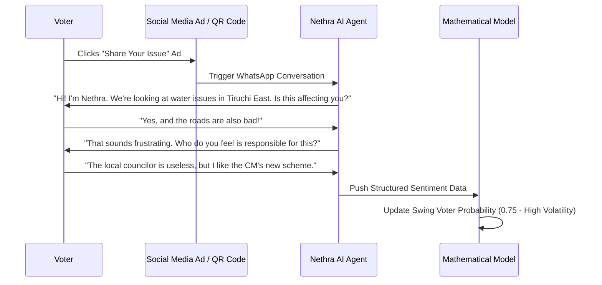

# AI-Driven Survey & Sentiment Engine

## The Problem with Traditional Polling
Traditional political polling is plagued by three major failures in the Indian context:
- **Social Desirability Bias:** Voters often give "correct" answers to strangers rather than revealing their true dissatisfaction.
- **Latency:** Physical surveys take weeks to process, missing rapid shifts in digital sentiment.
- **Cost/Scale:** Large-scale physical polling is prohibitively expensive for constant monitoring.

## The Nethra Solution: Conversational Micro-Surveys
Nethra bypasses these issues by engaging voters through familiar channels: **WhatsApp, Instagram DMs, and Facebook Messenger**. Instead of a sterile 50-question form, Nethra uses AI agents to conduct natural, 2-minute conversations.

### Primary Data Extraction Points
- **Issue Mapping:** Automatically extracting specific local grievances (e.g., "Youth Unemployment", "Water Supply").
- **Sentiment Scoring:** Using NLP to quantify the intensity of support or anger (-1.0 to +1.0).
- **Swing Classification:** Identifying voters who express cross-party support.
- **Verified Contact:** Capturing the voter's phone number for follow-up intervention via Custom Audiences.

## Implementation Strategy
### 1. Triggering Participation
Participation is incentivized through highly localized digital ads or physical QR codes at local hubs leading to a WhatsApp Business API interface.

### 2. The AI Conversation Engine
Uses LLMs (GPT-4o or Claude 3.5) with strict system prompts to maintain political neutrality during data collection.

### 3. Feedback Loop
Data flows directly into the mathematical model, providing real-time signals on which booths are "flipping".
