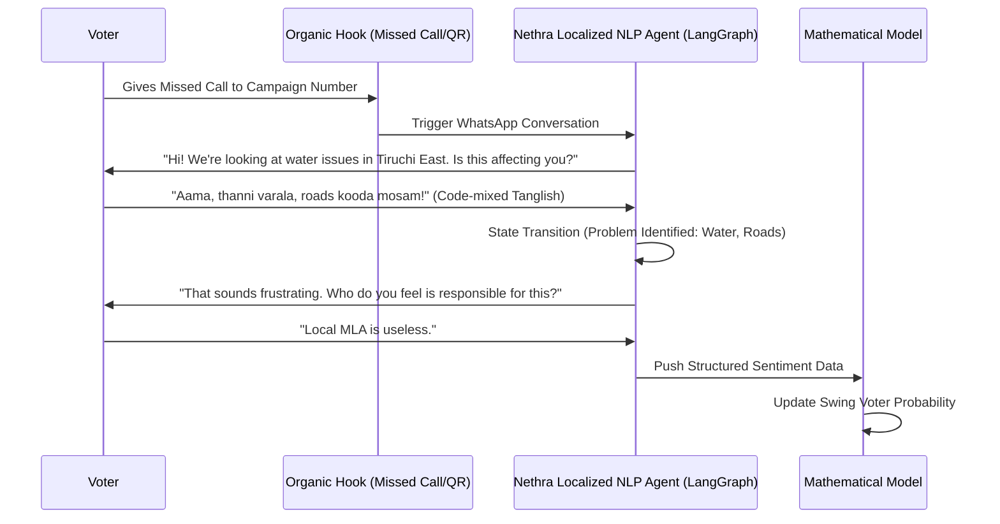

# AI-Driven Survey & Sentiment Engine

## 1. The Nethra Solution: Conversational Micro-Surveys
Nethra uses AI agents to conduct natural, 2-minute conversations over WhatsApp and Social Media DMs.



## 2. Implementation Specifications
- **State Management:** Conversational flows are managed via **LangGraph**. This allows the AI to handle non-linear dialogues (e.g., a voter asking a question back) while eventually steering them to provide required sentiment data.
- **System Prompting:**
    ```text
    SYSTEM: You are "Nethra", a neutral research assistant. Your goal is to gather sentiment. 
    1. Do not argue with the voter. 
    2. Do not reveal political bias. 
    3. If asked who you work for, state "The Citizens Action Research Group".
    4. Extract specific issues (Entities) and intensity (Sentiment).
    ```
- **NLP Pipeline:** Fine-tuned `Llama-3-8B` for Intent Classification. It is trained on 100k+ samples of code-mixed regional text (Tanglish, Hinglish, Telugu-English) to ensure 95%+ accuracy in entity extraction.

## 3. Fraud & Poisoning Prevention
- **Anti-Bot Mechanisms:** 
    - **Rate Limiting:** Max 3 conversations per phone number per week.
    - **Coordinated Attack Detection:** Detection of high-frequency interactions from specific towers or IP ranges (via ad-tech metadata).
    - **Semantic Check:** AI identifies repetitive or "scripted" responses typical of rival party "trolls."

## 4. Business Metrics & ROI
- **Funnel Conversion (Estimated):**
    - **Missed Call -> WhatsApp Conversion:** 65%
    - **WhatsApp Opt-in -> Survey Completion:** 40%
- **Incentivization Strategy:**
    - "Complete this survey to receive a personalized AI audio message from [Leader Name] thanking you for your feedback."
    - Gamified resolution loops: "Your complaint about [Issue] is #452 and has been escalated."

## 5. Deployment Lifecycle
Conversations are deployed in "Bursts." 
1. **Pilot Phase:** 5,000 interactions to tune localized NLP weights.
2. **Growth Phase:** Continuous monitoring of sentiment across 60,000+ booths.
