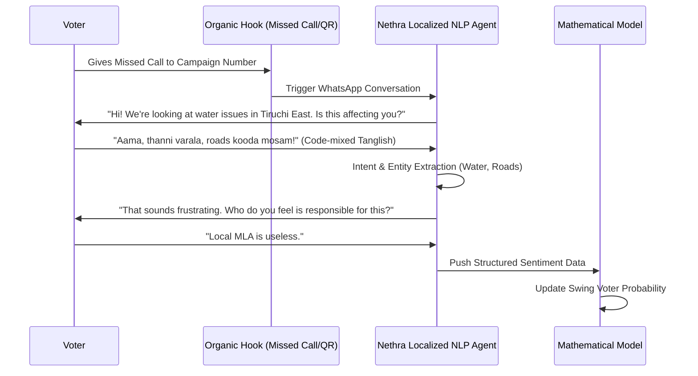

# AI-Driven Survey & Sentiment Engine

## The Problem with Traditional Polling
- **Social Desirability Bias:** Voters lie to strangers.
- **Latency:** Physical surveys take weeks.
- **Cost/Scale:** Prohibitively expensive.

## The Nethra Solution: Conversational Micro-Surveys
Nethra engages voters through familiar channels. Instead of a sterile form, Nethra uses AI agents to conduct natural conversations.

### Advanced Data Extraction Points
- **Code-Mixed NLP:** Off-the-shelf OpenAI models struggle with deep local slang (e.g., UP rural dialects, Tanglish). Nethra utilizes fine-tuned open-source models (e.g., LLaMA-3) specifically trained on regional social media corpora for highly accurate **Intent Classification**.
- **Entity Extraction:** Separating the *Issue* (Water) from the *Target* (Local MLA vs. Chief Minister). A voter angry at the local MLA but supportive of the CM is a prime swing target.
- **Opt-in Seeding Strategy (Political Reality):** To initiate these conversations without spamming, parties will use "Missed Call Campaigns", Influencer bio-links, and "Scan to complain" QR codes at local tea shops.

## Feedback Loop & Gamification
Data flows directly into the model. To ensure continued participation, the AI agent provides a "resolution loop" (e.g., "Thank you. Your concern about the road has been logged as #452 and sent to the district secretary").
