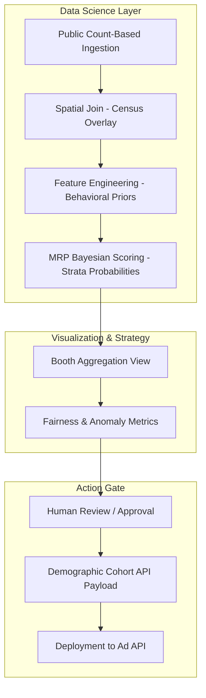

# Nethra: Technical Specifications

## 1. Dual-Track Architecture
Nethra employs a dual-track strategy, prioritizing **Mathematical Precision** in the prototype.

### Track 1: The Zero-Friction Prototype (The MRP Asset)
Designed to prove the effectiveness of the demographic projection engine.
*   **Frontend:** **Streamlit**. Renders 3D geospatial maps and demographic volatility distributions.
*   **Data Engine:** Static CSV/JSON. Uses `poststratification_frame.csv` as the primary ML input layer.
*   **Model Core:** Simulated **Bayesian Multilevel Regression** scoring, incorporating behavioral multipliers and poststratification logic.
*   **AI Intervention:** Use of Gemini API to generate scripts tailored to specific high-volatility demographic strata.

### Track 2: The Production Vision
A scalable, cloud-native architecture for real-world political battlegrounds.
*   **Cloud:** AWS (EKS, MSK).
*   **Real-time Analytics:** **ClickHouse** (OLAP) for aggregating millions of strata-level probabilities instantly.
*   **Security:** Privacy-by-design via count-based ingestion (Zero-PII).

---

## 2. Core Functional Requirements

### For the Political Leadership (Analytical Intel)
*   **Booth Volatility Map:** 3D visualization of booths color-coded by projected swing voter counts.
*   **Demographic Sensitivity Audit:** Live tracking of which voter segments (strata) are most volatile.
*   **Anomaly Engine:** Flagging anomalous ground reports by comparing MRP projections to Cadre logs.
*   **Cohort Deployment:** One-click approval to push targeted ad parameters to external ad APIs.

### For the ML/Data Engineering Team (Technical Rigor)
*   **Bayesian Weighting:** Integration of cognitive multipliers ($\gamma$) as priors in the regression model.
*   **Poststratification Pipelines:** Automated aggregation of strata-level probabilities to booth-level totals.
*   **Privacy-by-Design ETL:** Count-based ingestion of demographic data from ECI/Census to ensure zero PII exposure.
*   **Targeting API:** A technical state machine that translates high-probability strata ($k$) into Meta/Google Demographic API payloads.

---

## 3. Data & AI Integration Flow

---

## 4. Compliance & Security Standards
*   **Zero-PII Boundary:** No individual voter names or phone numbers enter the Nethra scoring boundary.
*   **Audit Log:** Persistent record of model weights, strata-level probabilities, and human approvals for every campaign deployment.
