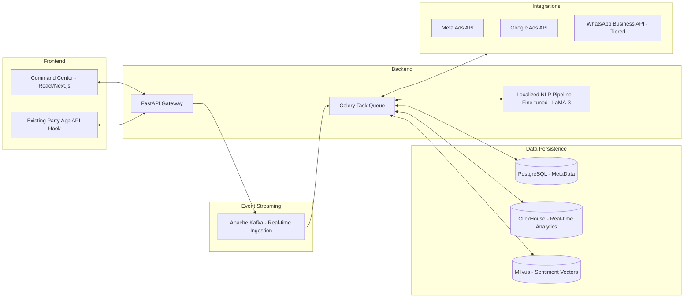

# Nethra: Technical Specifications

## 1. System Architecture
Nethra is a modular, cloud-native platform prioritizing data privacy, real-time processing of high-velocity social signals, and multi-lingual NLP.

## 2. Technology Stack & Infrastructure
- **Cloud Infrastructure:** AWS (EKS for compute orchestration, MSK for managed Kafka, RDS for Postgres, ElastiCache for Redis).
- **Backend:** Python 3.11+, FastAPI, Celery (for asynchronous task management).
- **Frontend:** Next.js (App Router), TailwindCSS, Shadcn/UI, Framer Motion.
- **AI/ML:** PyTorch, HuggingFace. Localized LLM: `Llama-3-8B-Instruct` fine-tuned with PEFT/LoRA for regional languages, served via **vLLM** for optimized throughput.
- **Database:** PostgreSQL (Relational metadata), ClickHouse (OLAP for sub-second aggregations over millions of events), Milvus (Vector storage for sentiment embeddings).

## 3. Core API Integration & Rate Limiting
### 3.1 Custom Audiences (Meta/Google)
- **PII Hashing:** SHA-256 hashing is performed **client-side** or in an isolated environment before transmission to ensure raw phone numbers never hit external logs.
- **Queuing:** Celery workers handle rate-limited API calls to Meta/Google, implementing exponential backoff to handle transient 429/500 errors.

### 3.2 WhatsApp Business API (Tiered Anti-Spam)
- **Anti-Spam:** Utilizes Tiered Opt-in flows (Missed Call -> Template Message -> Session Message).
- **Silent Period Compliance Mode:** A high-priority background job hard-stops all active campaign dispatches 48 hours prior to the voting window to ensure ECI compliance.

## 4. Business & Cost Estimation
- **Data Silos:** Each political client is provisioned with a physically isolated database (tenant-per-database) to ensure zero cross-contamination.
- **DPDP Act Compliance:** Built-in "Right to Erasure" and automated cryptographic shredding of PII post-election cycle.
- **Estimated Operational Cost:**
    - **Infrastructural Floor:** ~$1,200/month (Base Kafka/ClickHouse/LLM GPU cluster).
    - **Variable Interaction Cost:** ₹0.45 per WhatsApp interaction (inclusive of Meta fees and LLM tokens).

## 5. Security & Auditability
- **SOC2 Ready:** Comprehensive logging of all PII access.
- **Role-Based Access Control (RBAC):** District-level secretaries can only view data within their assigned jurisdiction.
