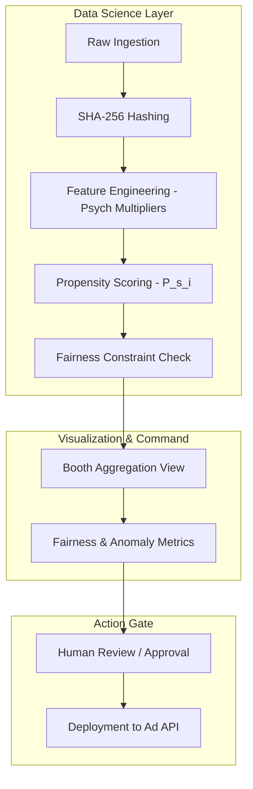

# Nethra: Technical Specifications

## 1. Dual-Track Architecture
Nethra employs a dual-track strategy, prioritizing **Mathematical Precision** in the prototype.

### Track 1: The Zero-Friction Prototype (The ML Asset)
Designed to prove the effectiveness of the propensity engine.
*   **Frontend:** **Streamlit**. Renders 3D geospatial maps and individual propensity distributions using PyDeck and Plotly.
*   **Data Engine:** Static CSV/JSON. Uses `individual_voter_features.csv` as the primary ML input layer.
*   **Model Core:** Simulated **Logistic Regression/XGBoost** scoring, incorporating behavioral multipliers and fairness constraints.
*   **AI Intervention:** Minimal use of Gemini API to demonstrate the final output of the intelligence pipeline.

### Track 2: The Production Vision
A scalable, cloud-native architecture for real-world political battlegrounds.
*   **Cloud:** AWS (EKS, MSK).
*   **Real-time Analytics:** **ClickHouse** (OLAP) for aggregating millions of individual $P_s$ scores instantly.
*   **Security:** Native SHA-256 hashing at the point of ingestion.

---

## 2. Core Functional Requirements

### For the Political Leadership (Analytical Intel)
*   **Individual Propensity Map:** 3D visualization of booths color-coded by voter volatility.
*   **Fairness Audit:** Live tracking of the model's demographic parity metrics.
*   **Anomaly Engine:** Flagging fraudulent ground reports using multi-dimensional outlier detection.

### For the ML/Data Engineering Team (Technical Rigor)
*   **Behavioral Weighting:** Integration of cognitive multipliers ($\gamma$) into the feature engineering pipeline.
*   **Fairness Gates:** Automated mathematical constraints to prevent demographic redlining.
*   **Data Minimization Pipeline:** Automated purging of raw PII post-scoring to ensure DPDP compliance.
*   **State Machine:** A "Human-in-the-Loop" approval gate for the intervention deployment.

---

## 3. Data & AI Integration Flow

---

## 4. Compliance & Security Standards
*   **Zero-Exposure PII:** Raw phone numbers never cross the scoring boundary.
*   **Audit Log:** Persistent record of model weights, fairness scores, and human approvals for every campaign.
