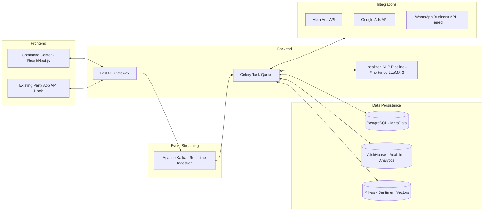

# Nethra: Technical Specifications

## System Architecture
Nethra is designed as a modular, cloud-native platform prioritizing data privacy, real-time processing of high-velocity social signals, and multi-lingual NLP.

## Technology Stack
- **Backend:** Python 3.11+, FastAPI, Celery, Apache Kafka (for streaming high-volume cadre inputs).
- **Frontend:** Next.js, TailwindCSS.
- **AI/ML:** PyTorch, HuggingFace (Fine-tuned local language models for code-mixed text like "Tanglish" or "Hinglish").
- **Database:** PostgreSQL (Relational metadata), ClickHouse (OLAP for sub-second aggregations of 60k+ booths), Milvus (Vector Search).

## Core API Integration Strategy
### 1. Phone Number Targeting (Custom Audiences)
Nethra uses First-Party Data matching via the `Meta Ads API` and `Google Customer Match`.
- **Privacy:** Phone numbers are hashed (SHA-256) *client-side* before transmission.
- **Identity Resolution:** To address the 60-70% match rate, Nethra uses probabilistic device-graphing based on shared IP and location data to model "household-level" targeting when individual matching fails.

### 2. WhatsApp Business API (Anti-Spam & Compliance)
To prevent the party's official WhatsApp numbers from being banned:
- Nethra utilizes **Tiered Opt-in flows** (e.g., missed call campaigns, physical QR scans at rallies) to trigger user-initiated messaging, which avoids Meta's spam filters.
- **Silent Period Compliance Mode:** An automated cron job that hard-pauses all active API dispatches 48 hours before voting day to comply with ECI regulations.

### 3. Party IT Cell Integration
Nethra does not replace existing party cadre apps. It exposes REST/GraphQL endpoints that seamlessly ingest unstructured reports from the party's existing mobile apps into the Kafka stream.
