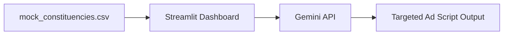

# Nethra: Technical Specifications

## 1. Dual-Track Architecture
As a Product Management imperative to prioritize speed to market, Nethra employs a dual-track architecture.

### Track 1: The Zero-Friction Prototype (Weeks 1-4)
Optimized for rapid development with **Gemini-CLI**, visual impact, and zero-infrastructure overhead.
- **Frontend & UI:** **Streamlit (Python)**. Provides native geospatial mapping (PyDeck) and rapid KPI dashboards with zero manual routing configuration.
- **Backend & Data:** Static CSV/JSON files. No database to provision or manage.
- **AI Engine:** **Google Gemini API** (via Vertex AI or AI Studio). Used to generate hyper-localized ad scripts based on booth-level issues.
- **Licenses:** 100% Free/Open-Source (MIT/Apache 2.0).

### Track 2: The Production Vision
The scalable, secure architecture designed for the political party's IT cell.
- **Cloud:** AWS (EKS for compute, MSK for Kafka).
- **Analytics:** **ClickHouse** (OLAP) for sub-second aggregations over millions of social signals.
- **Intervention:** Official Meta/Google Ads API for Custom Audience matching.
- **NLP:** Localized LLaMA-3 fine-tuned for regional dialects, served via vLLM.

## 2. Core Prototype Features (The Demo Flow)
1. **The Swing Map:** A geospatial visualization of a target district. Hex-bins are color-coded by **Swing Voter Density**.
2. **Constituency Deep-Dive:** Clicking a region populates the sidebar with:
   - Estimated Swing Voter Population count.
   - Top 3 Key Issues driving that population (e.g., "Toll Road Prices", "Water Quality").
3. **Engagement Generator:** A "Generate Intervention" button that calls the Gemini API to output a 15-second Instagram Reel storyboard and script tailored to that region's issues.

## 3. Data Flow (Prototype)

## 4. Security & Compliance (Production)
- **DPDP Act Compliance:** Automated PII shredding 7 days post-election.
- **SHA-256 Hashing:** All phone numbers are hashed client-side before being pushed to ad platforms.
- **Silent Period Kill Switch:** A global red button to halt all external API calls 48 hours before polling day.
