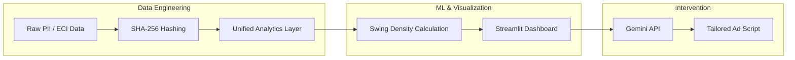

# Nethra: Technical Specifications

## 1. Dual-Track Architecture
Nethra employs a dual-track strategy to balance immediate Business Development (BD) needs with long-term production scalability.

### Track 1: The Zero-Friction Prototype (The BD Asset)
Designed for visual impact and speed to market.
*   **Frontend:** **Streamlit**. Provides the "Command Center" UI with native geospatial mapping.
*   **Data Layer:** Static CSV/JSON. Simulates real-time pipelines using `mock_constituencies.csv`.
*   **Security (Simulated):** Demonstrates the SHA-256 hashing pipeline using fake PII to prove privacy capabilities to IT cells.
*   **AI Engine:** **Google Gemini API**. Generates hyper-localized social media interventions.

### Track 2: The Production Vision (The Enterprise Solution)
A scalable, cloud-native architecture designed for the party's IT cell.
*   **Cloud:** AWS (EKS for compute, MSK for Kafka).
*   **Analytics Engine:** **ClickHouse** (OLAP) for sub-second aggregations over millions of voter/sentiment signals.
*   **Security:** Native integration with internal Cadre Apps (SARAL/Shakti) via secure APIs.
*   **Data Sovereignty:** All hashed data is stored in the party's VPC.

---

## 2. Core Functional Requirements

### For the Political Leadership (Business Value)
*   **Swing Voter Heatmap:** Real-time visualization of voter volatility.
*   **Anomaly Detection:** Identification of fraudulent ground reports from cadre.
*   **ROI Dashboard:** Proof of causal impact via **Synthetic Control** modeling.
*   **Ethical Kill Switch:** Global "Silent Period" button to halt all AI ad deployments 48 hours before polling.

### For the ML/Data Engineering Team (Technical Rigor)
*   **Deterministic Lookalike Pipeline:** SHA-256 hashing of phone numbers for privacy-preserving ad targeting.
*   **Heuristic Logic:** Calculation of **Swing Voter Density ($S_d$)** using ECI margins and social saliency.
*   **Data Contracts:** Strict JSON schemas for ingesting raw ground reports and social sentiment.
*   **HITL Approval Gate:** A technical state machine requiring a manual "Approved" flag before the intervention output is sent to external ad APIs.

---

## 3. Data & AI Integration Flow

---

## 4. Compliance & Security Standards
*   **DPDP Act 2023:** Full alignment via client-side hashing and automated data shredding.
*   **Zero-Exposure PII:** No raw phone numbers or names ever leave the local transient memory during the hashing process.
*   **Audit Log:** Full traceability of all AI-generated campaigns to prevent rogue messaging.
