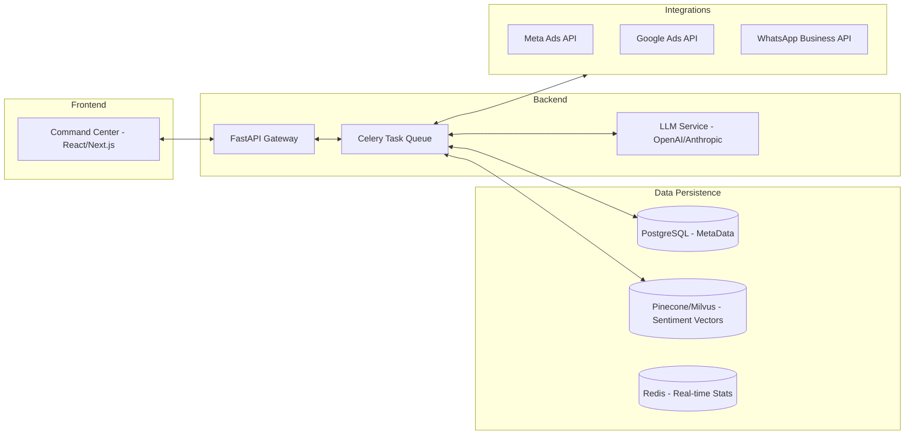

# Nethra: Technical Specifications

## System Architecture
Nethra is designed as a modular, cloud-native platform prioritizing data privacy and real-time processing of high-velocity social signals.

## Technology Stack
- **Backend:** Python 3.11+, FastAPI, Celery
- **Frontend:** Next.js, TailwindCSS, Framer Motion
- **AI/ML:** PyTorch, Transformers, LangChain
- **Database:** PostgreSQL (Relational), Pinecone (Vector Search)
- **Infrastructure:** AWS/Azure, Docker, Kubernetes

## Core API Integration Strategy
### 1. Phone Number Targeting (Custom Audiences)
Nethra uses First-Party Data matching via the `Meta Ads API` and `Google Customer Match`. Phone numbers are hashed using SHA-256 before transmission to ensure privacy compliance.
- **Payload:** `{ "schema": ["PHONE"], "data": ["hash1", "hash2", "..."] }`
- **Match Rate Goal:** 70%+ for Indian mobile numbers.

### 2. Dynamic Content Generation
The system utilizes an LLM-based agent to analyze booth-level grievances and generate 15-second video scripts. These are passed to a synthetic media engine (or routed to content creators) to generate hyper-localized Reels and YouTube Shorts.

## Security & Privacy
- **Data Isolation:** Each political client has a dedicated database schema.
- **PII Protection:** All voter phone numbers are encrypted at rest. Access is strictly audited and restricted to the Audience Dispatcher service.
- **Audit Logging:** Every interaction with ad platforms is logged to provide verifiable metrics for the ROI calculations.
