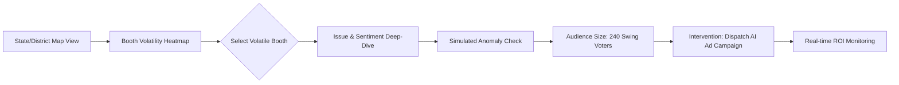

# Nethra Command Center: Visualization Specs

## 1. Dashboard User Flow

## 2. The "Booth Intelligence" UI Component
**BOOTH: TN-234-001 (Tiruchi East)**
- **Volatility Index:** 0.88 (CRITICAL)
- **Top Grievances:** Youth Unemployment, Irregular Water Supply.
- **Cadre Status:** ANOMALY DETECTED.

## 3. Visual Design Standards
- **Theme:** Dark Mode primary.
- **Geospatial:** MapBox GL JS for booth-level zooming.
- **Sentiment Indicators:** Green (+1.0) supporters, Red (-1.0) angry opponents, Yellow (0) swing voters.
