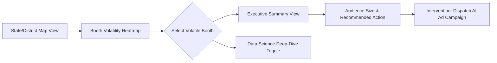

# Nethra Command Center: Visualization Specs

## 1. Dashboard User Flow
The UI must serve both the Data Scientist and the non-technical Political Boss. 

## 2. The "Booth Intelligence" UI Component
**BOOTH: TN-234-001 (Tiruchi East)**

*Executive View:*
- **Opportunity Score:** 8.8/10 (High chance of flipping)
- **Target Audience:** 240 Swing Voters
- **Primary Issue:** Youth Unemployment
- **Action:** [DISPATCH TARGETED ADS - Est. Cost: ₹2,400]

*Data Science View (Toggled):*
- **BVI Components:** $M_{hist}$: 0.2, $S_{vol}$: 0.8, $I_{unrest}$: 0.6
- **Anomaly Detection:** Cadre ID #442 flagged. Isolation Forest score: -0.85 (High Anomaly).
- **Match Rate Health:** Meta (72%), Google (68%)

## 3. Visual Design Standards
- **Theme:** Dark Mode primary.
- **Geospatial:** MapBox GL JS. We will render **Hex-bin maps** over traditional booth polygons if exact geographic booth boundaries are unavailable (which is common in India).
- **Executive simplicity:** Eliminate jargon on the main screen. Use terms like "Opportunity Score" instead of "Volatility Index", and "Data Quality" instead of "Anomaly Score".

## 4. The Compliance Dashboard
A dedicated tab for the Legal/IT Cell:
- Real-time audit logs of all Meta/Google API dispatches.
- **"Silent Period Kill Switch"**: A massive, unmissable red button to halt all outgoing digital targeting instantly to comply with Election Commission mandates.
